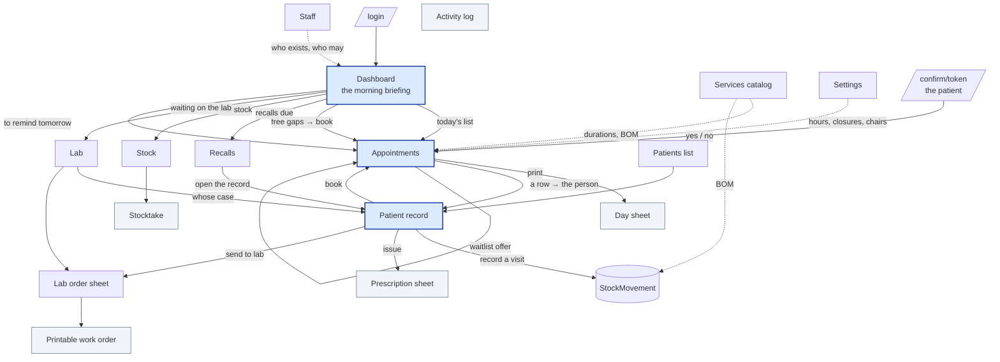
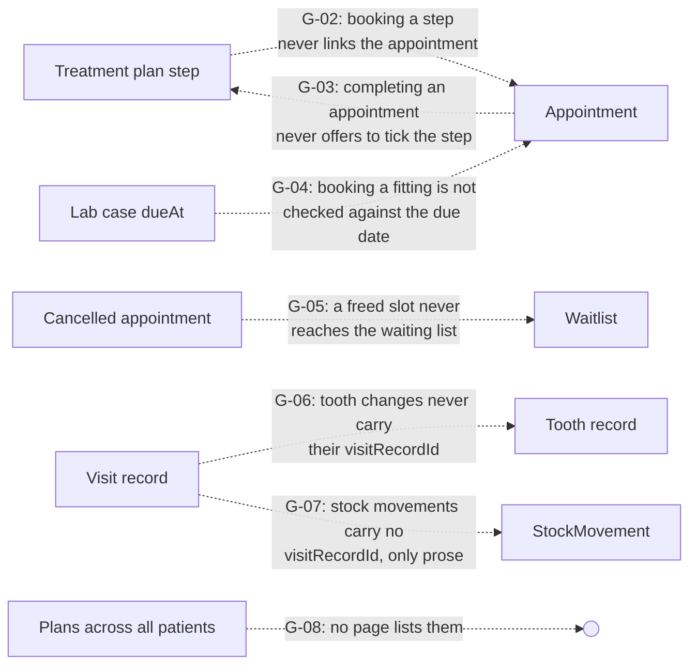
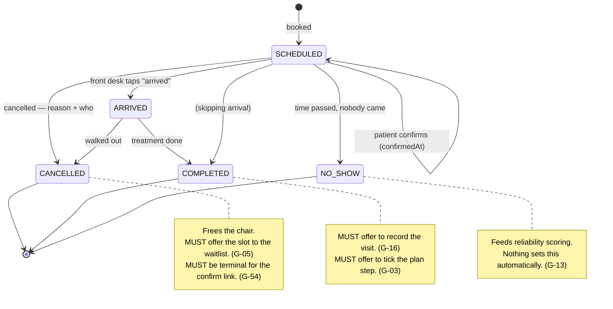
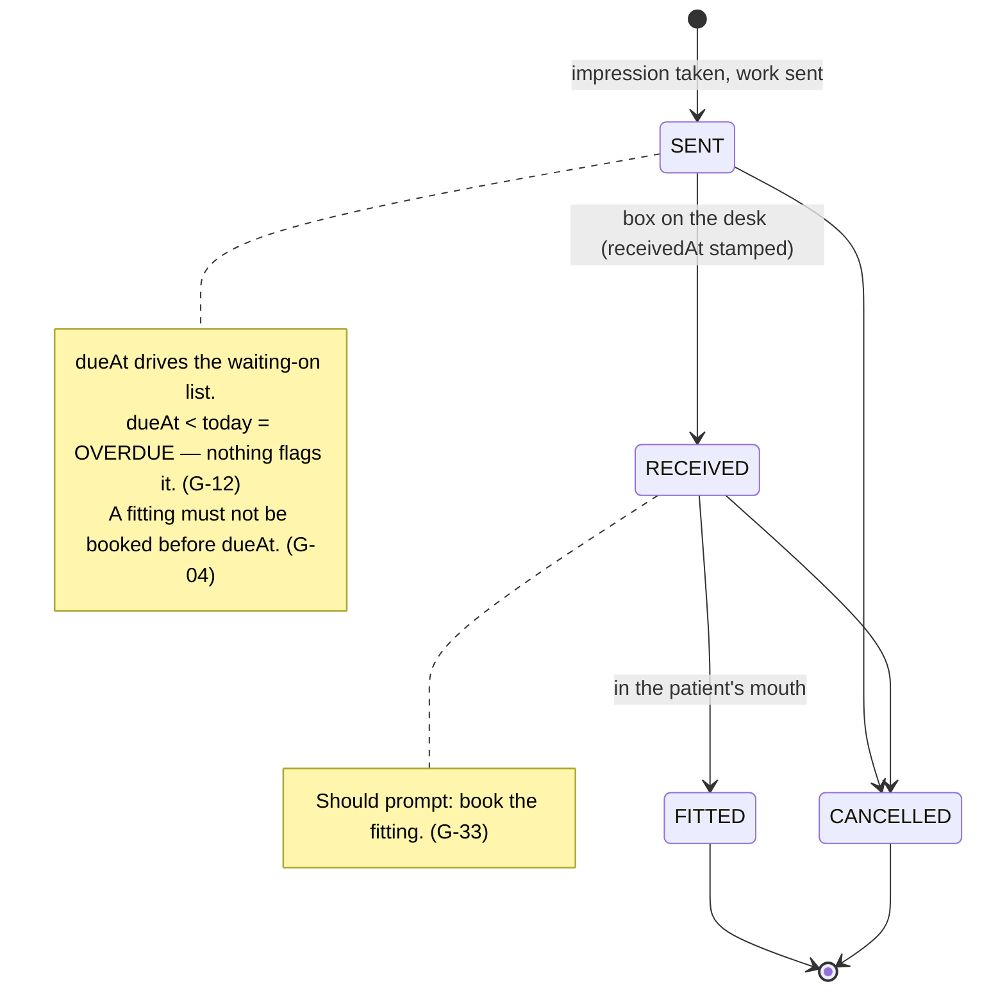
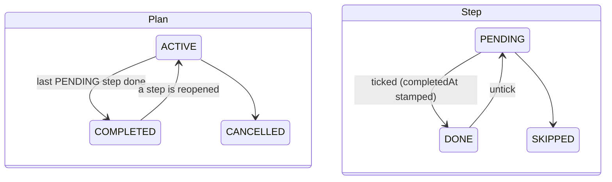
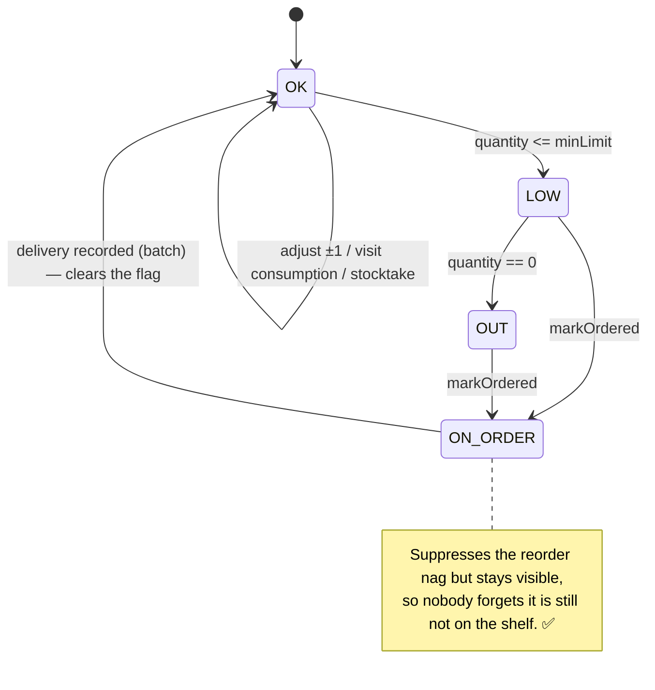
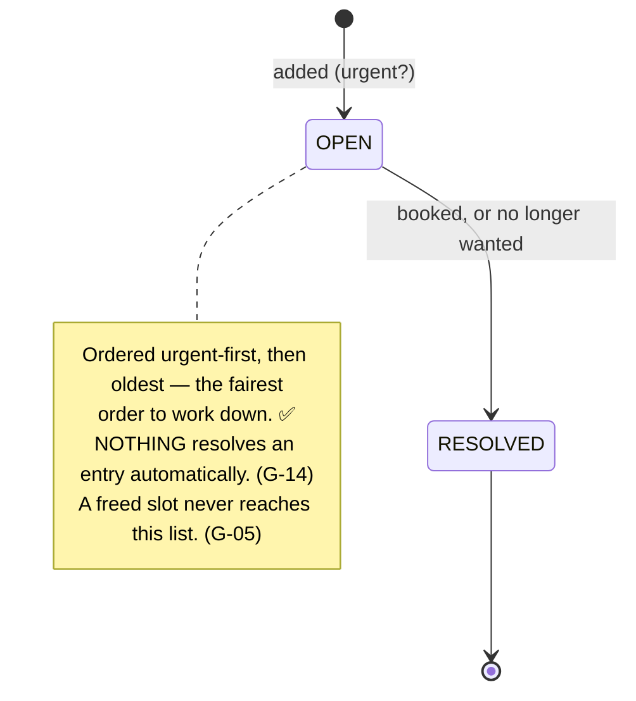

# DentOrganizer — Page Blueprint and Logic Flows

**What every screen is, what it represents, how the screens are wired to each
other, and what the system should do on its own.**

This document is written as a *specification of the intended system* — the
theory — not as a description of the code. Where the code already matches, it
says so. Where it does not, the gap is named in place and collected again in
[§8](#8-gap-register).

Companion documents:

| Document | Answers |
| --- | --- |
| [DATA-MODEL.md](DATA-MODEL.md) | What the tables are and how they relate |
| [IMPROVEMENTS.md](IMPROVEMENTS.md) | What is wrong with the code that exists |
| [ROADMAP.md](ROADMAP.md) | What entities did not exist yet (phases 1–10, all now implemented) |
| **This document** | What the *screens and flows* are supposed to be, end to end |

**Status marks used throughout**

| Mark | Meaning |
| --- | --- |
| ✅ | Built and behaves as specified |
| ⚠️ | Built but incomplete, inconsistent, or not wired to its consequence |
| ❌ | Specified here, does not exist |
| 🔒 | Deliberately not built (a stated design decision, not a gap) |

---

## Progress

Stages are defined in [§9](#9-suggested-build-order). Gap numbers refer to
[§8](#8-gap-register), which carries the current status of each.

| Stage | State |
| --- | --- |
| **1 — Stop losing data** | ✅ **complete.** G-27, G-37, G-38, G-54, G-26, G-39 all closed |
| **2 — Close the loops** | ✅ **complete.** G-13, G-14, G-21, G-23, G-06, G-07, G-05, G-16 all closed |
| **3 — Wire the orphaned features** | ✅ **complete.** G-02, G-03, G-08, G-04, G-12, G-33, G-01 all closed |
| **4 — Surface what is derived** | ✅ **complete.** G-09, G-10, G-11, G-15, G-31, G-17, G-42 closed, plus G-44 and G-45 |
| **5 — Fix Bridge A** | ⬜ not started — G-25, G-43, G-36 |
| **6 — Scale and operations** | 🟡 the index half is done (IMPROVEMENTS §3.2) plus §3.3, the recalls double-query |
| **7 — Deferred by choice** | ⬜ deliberately deferred |

**Two structural edges were added to the graph in [§3.3](#33-what-is-not-connected-but-should-be):**
plan step ⇄ appointment (both directions), and lab due date → the booking check.
Both were promised by schema comments and neither existed.

**One permission was split.** `lab.view` / `lab.edit` came out of `plan.*`
([§2.2](#22-who-can-reach-what)): a lab case is logistics, not diagnosis, and the
person who most needs to know a crown is not back is the person booking the
fitting. The receptionist now has both and still has no `plan.view`.

**One page was added.** [`/plans`](../src/app/[locale]/(app)/plans/page.tsx) —
every course of treatment across all patients, stalled ones first.

Still outstanding from the stages already touched, and worth knowing before
reading further:

- **No migration history.** The schema changes above went in via `db push`. The
  baseline (`prisma migrate dev --name init`) is still owed before this runs
  anywhere real — see [IMPROVEMENTS §4.1](IMPROVEMENTS.md#41-no-migration-history).
- **No tests.** Every fix in stage 1 is exactly the kind of thing a six-file
  `node:test` suite would hold in place — see
  [IMPROVEMENTS §4.4](IMPROVEMENTS.md#44-there-are-no-tests).

---

## Table of contents

1. [The model of the practice](#1-the-model-of-the-practice)
2. [Route map](#2-route-map)
3. [The connection graph](#3-the-connection-graph)
4. [Page specifications](#4-page-specifications)
5. [Canonical state machines](#5-canonical-state-machines)
6. [The propagation matrix — when X happens, Y must change](#6-the-propagation-matrix)
7. [The derivation layer](#7-the-derivation-layer)
8. [Gap register](#8-gap-register)
9. [Suggested build order](#9-suggested-build-order)

---

## 1. The model of the practice

### 1.1 The app is six loops, not twenty tables

A dental practice is not a database with a UI on it. It is six repeating cycles
that each start somewhere and must be *closed*. Every screen in this app exists
to advance exactly one loop and to hand off to the next.

| # | Loop | Opens when | Closes when | Fails silently when |
| --- | --- | --- | --- | --- |
| **L1** | **The Diary** | A slot is promised | The slot is kept or released | A slot is neither kept nor released — it just passes |
| **L2** | **The Record** | Somebody sits in the chair | What happened is written down | Treatment happens and nothing is written |
| **L3** | **The Return** | A patient leaves | They are seen again | Nobody notices they never came back |
| **L4** | **The Supply** | A material is consumed | It is replaced on the shelf | The cupboard is empty on the morning it is needed |
| **L5** | **The Outsourcing** | Work is sent to a lab | The work is back and fitted | A fitting is booked before the crown returns |
| **L6** | **The Trust** | Anyone touches anything | The change is attributable | A record changes and nobody knows who or why |

Every loop has the same three-beat shape:

```
        ┌──────────────┐
        │   PROMISE    │  something is committed to (a slot, a plan, an order)
        └──────┬───────┘
               │
        ┌──────▼───────┐
        │   EVIDENCE   │  reality is recorded against the promise
        └──────┬───────┘
               │
        ┌──────▼───────┐
        │   CLOSURE    │  the promise is discharged, or explicitly abandoned
        └──────────────┘
```

**A loop that cannot close is the definition of a bug in this app**, even when
every individual screen works. Most of the gaps in [§8](#8-gap-register) are
exactly this: a promise that has no closure path.

### 1.2 The organising rule: *derive, don't store — nudge, don't send*

Two rules hold across the whole system and should not be broken without a
deliberate decision:

**Derive, don't store.** Almost nothing is denormalised. "Who is overdue", "what
is free on Thursday", "what to order", "how reliable is this patient" are all
recomputed from raw rows on every render. Nothing goes stale, and there is no
maintenance job to forget to run. The cost is that the read paths carry the
complexity — which is why [§7](#7-the-derivation-layer) exists.

**Nudge, don't send.** The app never contacts a patient itself. It composes the
message and opens WhatsApp or the mail client; a human presses send. This is not
a missing feature — it is the reason the practice trusts it.

### 1.3 What "automation" means here

Because of rule two, "automate this" can never mean "send it automatically". It
means one of four things, and they should be kept distinct when discussing any
feature:

| Tier | Name | Definition | Needs a clock? |
| --- | --- | --- | --- |
| **T0** | **Derivation** | A pure function over current rows answers a question nobody has to work out by hand | No |
| **T1** | **Propagation** | One recorded fact updates every dependent record, in the same transaction | No |
| **T2** | **Surfacing** | The derived answer appears on the screen where the work is already happening, unasked | No |
| **T3** | **Sweep** | Something must change because *time passed*, with no user action to hang it on | **Yes** |

**The system is overwhelmingly T0/T1/T2.** Very little genuinely needs a
scheduler — see [§6.4](#64-the-only-things-that-genuinely-need-a-clock). Most of
what feels like "missing automation" in this app is actually **missing T1
propagation**: a fact is recorded correctly in one place and never reaches the
three other places that depend on it.

That is the single most useful lens for fixing the code.

### 1.4 The four data clusters and the two bridges

```
   ┌─────────────────┐        ┌────────────────────────────────┐
   │  PEOPLE/ACCESS  │        │       THE PATIENT RECORD       │
   │  StaffUser      │◄──────►│  Patient · Visit · Tooth ·     │
   │  AuditLog       │ actor  │  Plan · Document · Prescription│
   └─────────────────┘        │  Alert · Contact · LabCase     │
                              └───────┬────────────────────────┘
                                      │ patientId (Cascade)
                              ┌───────▼────────────────────────┐
                              │           THE DIARY            │
                              │  Appointment · WaitlistEntry   │
                              │  ClinicHours · Closure · Operatory
                              └───────┬────────────────────────┘
                                      │
                       ═══════ BRIDGE A: BY TEXT ONLY ═══════
                        Appointment.serviceName   (String)
                        VisitRecord.services      (String, CSV)
                        WaitlistEntry.serviceName (String)
                                      │
                              ┌───────▼────────────────────────┐
                              │    CATALOG AND CUPBOARD        │
                              │  Service ⇄ ServiceMaterial ⇄   │
                              │  StockItem · StockMovement ·   │
                              │  StockBatch · Supplier         │
                              └────────────────────────────────┘
                                      ▲
                       ═══════ BRIDGE B: BY KEY ═══════
                        VisitFormDialog submits hidden `serviceIds`
                        → consumeMaterialsForServices()
```

**Bridge A is the structural weakness of the whole system** and it is the root
cause of a surprising number of page-level gaps: analytics groups by typed text,
a service rename does not reach the calendar, and the visit's *text* list and
the visit's *deducted materials* can disagree with nothing to reconcile them.
See [IMPROVEMENTS §2.1](IMPROVEMENTS.md#21-services-are-referenced-by-text-not-by-key).

---

## 2. Route map

### 2.1 Everything that is addressable

| Route | Guard | Loop | What it is |
| --- | --- | --- | --- |
| `/[locale]/login` | none | L6 | Staff picker + PIN pad |
| `/[locale]/confirm/[token]` | HMAC in URL + rate limit | L1 | The patient's own yes/no |
| `/[locale]/` | `requireUser()` | all | **Dashboard** — the morning briefing |
| `/[locale]/appointments` | `appointment.view` | L1 | **The diary** — day / week / list + waitlist |
| `/[locale]/day-sheet` | `appointment.view` | L1 | The day as a sheet of paper |
| `/[locale]/patients` | `patient.view` | L2 | The file drawer |
| `/[locale]/patients/[id]` | `patient.view` + per-tab | L2/L3/L5 | **The record** — nine tabs |
| `/[locale]/recalls` | `recall.view` | L3 | Who to call, and why |
| `/[locale]/services` | `service.view` | L4 | The catalog + prescription templates |
| `/[locale]/lab` | `plan.view` | L5 | What is out at a laboratory |
| `/[locale]/lab/[id]` | `plan.view` | L5 | One case, opened up — the order sheet |
| `/[locale]/lab/[id]/sheet` | `plan.view` | L5 | The work order, printable |
| `/[locale]/stock` | `stock.view` | L4 | The cupboard + reorder + suppliers |
| `/[locale]/stock/stocktake` | `stock.**edit**` | L4 | Counting the room |
| `/[locale]/prescriptions/[id]` | `prescription.view` | L2 | One prescription, printable |
| `/[locale]/analytics` | `analytics.view` | — | Six months of the practice |
| `/[locale]/settings` | `settings.view` | L1 | Hours, closures, chairs, profile, feed |
| `/[locale]/staff` | `staff.manage` | L6 | People, the permission matrix, backup |
| `/[locale]/activity` | `audit.view` | L6 | The append-only trail |
| `/api/documents/[id]` | `document.view` | L2 | Serves an X-ray, 404s without a session |
| `/api/calendar/[token]` | HMAC in URL | L1 | One dentist's diary as iCalendar |
| `/api/backup` | `backup.export` | L6 | Full export, optionally encrypted |
| `/api/health` | none | — | Yes or no, nothing about the practice |

### 2.2 Who can reach what

Derived from [`permissions.ts`](../src/lib/auth/permissions.ts). This is the
table to check first whenever a page "does not work for someone".

| Page | Owner | Assistant | Receptionist | Read-only |
| --- | :-: | :-: | :-: | :-: |
| Dashboard | ✅ | ✅ | ✅ | ✅ |
| Appointments | ✅ | ✅ | ✅ | 👁 |
| Day sheet | ✅ | ✅ | ✅ | 👁 |
| Patients (list + details tab) | ✅ | ✅ | ✅ | 👁 |
| Patient → chart / history | ✅ | ✅ | ❌ | 👁 |
| Patient → plans | ✅ | ✅ | ❌ | 👁 |
| Patient → documents | ✅ | ✅ | ❌ | 👁 |
| Patient → prescriptions | ✅ | 👁 | ❌ | 👁 |
| Patient → contacts | ✅ | ✅ | ✅ | 👁 |
| Patient → lab | ✅ | ✅ | ❌ | 👁 |
| Recalls | ✅ | ✅ | ✅ | 👁 |
| Services | ✅ | 👁 | 👁 | 👁 |
| **Lab** | ✅ | ✅ | **❌** | 👁 |
| Stock | ✅ | ✅ | 👁 | 👁 |
| Stocktake | ✅ | ✅ | ❌ | ❌ |
| Analytics | ✅ | ❌ | ❌ | ✅ |
| Settings | ✅ | 👁 | 👁 | 👁 |
| Staff | ✅ | ❌ | ❌ | ❌ |
| Activity | ✅ | ❌ | ❌ | ❌ |

✅ full · 👁 read-only · ❌ not reachable, and not advertised in the nav

> ⚠️ **Gap G-01 — the receptionist cannot see the lab list.** `/lab` is gated on
> `plan.view`, which the receptionist does not have. But scheduling a fitting
> around a delivery date is *front-desk work*: the person who books the
> appointment is the person who needs to know the crown is not back. Either the
> lab list needs its own `lab.view` permission granted to the front desk, or the
> due dates need to surface on the calendar (which is the better fix — see
> [§4.3](#43--appointments)).

---

## 3. The connection graph

### 3.1 How a person moves through the app



### 3.2 The three hubs

Everything in this app orbits three screens. If a piece of information has no
route to one of these three, nobody will ever see it.

| Hub | Question it answers | Time horizon |
| --- | --- | --- |
| **Dashboard** | "What needs me *today*?" | Today, plus tomorrow's reminders |
| **Appointments** | "What is committed, and what is still free?" | Any day |
| **Patient record** | "Who is this person and what have we done?" | All of history |

**Design rule:** every derived signal in [§7](#7-the-derivation-layer) must land
on at least one hub. A signal that only appears on a leaf page (stocktake, day
sheet, activity) will be discovered by accident or not at all.

### 3.3 What is *not* connected but should be

These are structural holes in the graph above — drawn as dashed lines that do
not yet exist in code.



Each is specified in the page section where it belongs and repeated in
[§8](#8-gap-register).

---

## 4. Page specifications

Each page below follows the same template:

- **Identity** — route, guard, who uses it, how often
- **What it represents** — the thing in the world, not the table
- **Reads / Writes**
- **Arrives from / Leads to**
- **The logic flow** — what the page must decide, in order
- **Should be automatic** — the T0/T1/T2 behaviour the page owes the user
- **Status** — what is built, what is missing

---

### 4.1 · `/login`

**Identity** — no guard. Every member of staff, once a shift. Rendered without
the app chrome.

**What it represents** — the boundary of the trust loop (L6). There is no
self-service signup by design: the owner creates every account from the Staff
page, so the login screen is a *picker*, not a form. A clinic PIN pad, not a
password field.

| | |
| --- | --- |
| **Reads** | Active `StaffUser` rows (name + role only) |
| **Writes** | `lastLoginAt`, `failedAttempts`, `lockedUntil`, session cookie, `AuditLog` (`login` / `denied`) |
| **Arrives from** | Any guarded page when there is no session |
| **Leads to** | Dashboard |

**The logic flow**

```
1. List active staff, grouped by role, largest tap targets available.
2. Person taps their own name.           → identity claimed, not proven
3. PIN pad, 4–6 digits.
4. Verify scrypt(pin, salt) == pinHash — constant time.
   ├─ match   → reset failedAttempts, stamp lastLoginAt,
   │            mint session cookie carrying ONLY the user id,
   │            audit `login`, go to dashboard
   └─ no match→ failedAttempts += 1
                if failedAttempts >= 5 → lockedUntil = now + 5 min
                audit `denied`
5. On every subsequent request the ROLE IS RE-READ from the database.
   The cookie never carries it. Demoting somebody takes effect on their
   next click; deactivating them ends their shift mid-shift.
```

**Should be automatic**

- **T1** — a locked account unlocks itself when `lockedUntil` passes; no admin
  action is needed for the ordinary case of a mistyped PIN. ✅
- **T2** — the login screen should say *why* a sign-in failed when the account
  is locked, with the time it frees up. Otherwise the person retries and extends
  their own lockout.

**Status** — ✅ built. Brute-force guard, constant-time compare, role re-read per
request, `cache()` keeping that to one query.

---

### 4.2 · `/` — Dashboard

**Identity** — `requireUser()` only; everyone who can sign in can open it. Read
first thing every morning, and again after lunch. **The single most important
screen in the application.**

**What it represents** — *the morning briefing*. Not a summary of the database —
a list of **things that will go wrong today if nobody acts**. The distinction
matters: a dashboard that shows totals is decoration; a dashboard that shows
*unclosed loops* is the product.

| | |
| --- | --- |
| **Reads** | Today's appointments · this week's count · patient count · low stock · free gaps for the rest of today · recalls due · lab cases still `SENT` · tomorrow's unreminded appointments |
| **Writes** | Nothing directly. Every write is delegated to a dialog (new patient, new appointment) or a row action. |
| **Arrives from** | Login, the logo, every "back" instinct |
| **Leads to** | Everywhere |

**The logic flow**

```
1. Establish identity and capability set.
2. Fan out ONE parallel query batch — never sequential; this page is
   the latency budget for the whole app.
3. Compute the four stat tiles, each of which is a LINK, not a number:
     today's count        → /appointments
     this week's count    → /appointments?view=week
     recalls due          → /recalls          (warn tone when > 0)
     low stock            → /stock?filter=low (warn tone when > 0)
   A stat that cannot be acted on does not belong on this page.
4. Two primary actions, full width, always in the same place:
     [+ New patient]  [+ New appointment]
5. Main column: today's list, in clock order, each row carrying
   status, confirmation state, and its own status buttons.
6. Side column, ordered by "what can still be changed today":
     a. FREE TIME  — gaps from NOW forward only.
                     Past free time is not an opportunity, it is a regret.
     b. TO REMIND  — tomorrow's appointments with no reminder logged,
                     no answer from the patient, and no recorded refusal.
     c. AT THE LAB — cases still SENT, soonest promised first.
                     Above stock, because a crown that has not come back
                     blocks an appointment; a low box of gloves does not.
     d. LOW STOCK  — the cupboard.
```

**Should be automatic**

| | Behaviour | Tier | Status |
| --- | --- | --- | --- |
| a | Free gaps are computed from real bookings *and* real opening hours, bounded by "now" | T0 | ✅ |
| b | "Who has not been told about tomorrow" is derived from the contact log, not remembered | T0+T2 | ✅ |
| c | Lab cases still out are surfaced without anybody opening the lab page | T2 | ✅ |
| d | Every panel disappears when empty, so a quiet morning shows a short page | T2 | ✅ |
| e | **Today's medical alerts** — CRITICAL/IMPORTANT alerts for people booked today should be on this page, not only on the printed day sheet | T2 | ❌ **G-09** |
| f | **Today's lab deliveries** — a case whose `dueAt` is today, or whose delivery window is today, belongs here | T2 | ❌ **G-10** |
| g | **Expired stock** — the stock page warns about expired lots; the dashboard only knows "low". An expired box counts as stock everywhere else | T2 | ❌ **G-11** |
| h | **Overdue lab cases** — `SENT` with `dueAt < today` should be visually distinct from merely pending; the panel currently sorts by `dueAt` but does not flag the ones already late | T0+T2 | ⚠️ **G-12** |
| i | **Yesterday's loose ends** — appointments still `SCHEDULED` with a date in the past are unclosed L1 loops. Nothing anywhere surfaces them | T0+T2 | ❌ **G-13** |

> **G-13 is the most consequential dashboard gap.** An appointment that was never
> marked `COMPLETED`, `NO_SHOW` or `CANCELLED` simply ages out of view. It then
> silently corrupts three downstream things: the reliability score (a no-show
> that was never recorded), the recall list (`getRecalls` suppresses anyone with
> a *future* `SCHEDULED` appointment — a stale past one does not suppress, which
> is correct, but the patient's last-visit date is now wrong), and the completion
> rate on analytics. The fix is a dashboard panel: **"N appointments from before
> today are still open — close them"**, plus the sweep in
> [§6.4](#64-the-only-things-that-genuinely-need-a-clock).

**Status** — ✅ the strongest page in the app. Panels (e)–(i) are the difference
between a good morning briefing and a complete one.

---

### 4.3 · `/appointments`

**Identity** — `appointment.view`. The screen the front desk lives in. Open
essentially all day.

**What it represents** — *the promise ledger*. Every row is a commitment made to
a human being. Three views over the same rows because three different questions
get asked:

| View | Question | Shape |
| --- | --- | --- |
| **Day** | "What is happening now, and what is free?" | Hour grid against real opening hours |
| **Week** | "How full are we?" | Seven columns |
| **List** | "What is coming up?" | Month agenda |

| | |
| --- | --- |
| **Reads** | Appointments in range (filtered by provider and status) · patients · services · operatories · open waitlist · free gaps for the anchored day · the day's schedule (hours − break − closures) · per-day counts for the month rail |
| **Writes** | Via dialogs and row actions: create/edit appointment (+ inline new patient), set status, cancel with reason and actor, delete, waitlist add/resolve, log a contact when a reminder is opened |
| **Arrives from** | Dashboard, patient record, day sheet, everywhere |
| **Leads to** | Patient record, day sheet |

**The logic flow — reading the page**

```
1. Parse the URL as the complete view state:
     view   ∈ {day, week, list}    default day
     date   YYYY-MM-DD             default today
     staff  provider id            dropped silently if unknown
     status comma list             default = all (omitted from the URL)
   Every navigation link REBUILDS this state rather than replacing it —
   stepping to tomorrow must not silently drop the provider filter.
2. Derive the date range from the view.
3. Fan out: appointments · options · waitlist · gaps · schedule(s) · counts.
4. Filter by status in memory (five statuses over one week is not a query
   worth splitting).
5. Render the view, plus:
     - the month rail (counts per day, so density is visible at a glance)
     - the status filter
     - the provider row (only when there is more than one provider —
       one dentist should never see a filter with one option)
     - the waitlist panel with THIS DAY's gaps beside it
```

**The logic flow — booking**

This is the most important write path in the application. It must go in this
order and no other:

```
saveAppointment(form)
 1. authorize('appointment.edit')                → else forbidden
 2. Parse and validate: patientId, date (strict YYYY-MM-DD),
    startTime (strict HH:MM), duration ≥ 5.
 3. If patientId == "__new__":
      require patient.edit
      validate first/last/phone
      HOLD the details — write nothing yet
 4. CONFLICT CHECK (unless force=1):
      load the day's SCHEDULED + COMPLETED appointments
      overlap = otherStart < end AND otherEnd > start
      collides = same dentist OR same chair
                 OR neither side proves them apart
      if any → return code:'overlap' with the clashing rows NAMED
               ("11:00 Arta Krasniqi (Dr B · Chair 2)")
    ── The check runs BEFORE any write, so a refused booking never
       leaves a half-created patient behind for the retry to duplicate.
 5. ONE transaction:
      create the patient if new
      create or update the appointment
 6. Audit both writes.
 7. revalidate.
```

**Warn, don't block** is the deliberate rule: the dialog offers *"book anyway"*
and the resubmit carries `force=1`. Squeezing in an emergency between two slots
is a real thing a dentist does, and a system that forbids it gets worked around
on paper.

**Should be automatic**

| | Behaviour | Tier | Status |
| --- | --- | --- | --- |
| a | Duration auto-fills from the chosen service | T1 | ✅ |
| b | Conflicts are named by *resource*, so "clashes with Dr B" and "clashes in chair 2" read differently | T0 | ✅ |
| c | A closed day / lunch break yields no free gaps rather than the whole day | T0 | ✅ |
| d | A first-time patient can be created inside the booking, atomically | T1 | ✅ |
| e | Filters survive navigation | T2 | ✅ |
| f | **A cancelled slot offers itself to the waiting list.** The moment an appointment is cancelled, the freed interval should be matched against open waitlist entries that *fit* it, and the front desk shown "3 people want a slot this size" with one-tap message drafts | T1+T2 | ❌ **G-05** |
| g | **Booking somebody from the waiting list resolves their entry.** Today `resolvedAt` is a separate manual click, so the list keeps people who were already booked | T1 | ❌ **G-14** |
| h | **A lab case due date blocks its own fitting.** Booking an appointment for a patient with an outstanding `SENT` case whose `dueAt` is after the proposed date should warn exactly the way a double-booking does — same shape, same override | T0+T2 | ❌ **G-04** |
| i | **A patient's medical alerts appear at booking time.** The day sheet prints them; the booking dialog does not show them. A CRITICAL alert should be visible when the slot is chosen, not when the sheet is printed | T2 | ❌ **G-15** |
| j | **A treatment plan step can be booked directly, and the booking links back.** `TreatmentStep.appointmentId` exists, is `@unique`, and is documented in the schema as "booking the step links it here, so '3 of 5 done' and the calendar agree" — **nothing reads or writes it** | T1 | ❌ **G-02** |
| k | **Completing an appointment offers to record the visit.** The single most common two-step action in the app (`status → COMPLETED`, then open the patient, then Record a visit) is not chained | T2 | ❌ **G-16** |
| l | **A past appointment left `SCHEDULED` is closed.** See G-13 | T3 | ❌ |

**Status** — ✅ views, filters, conflicts, waitlist display. ⚠️ the waitlist is
displayed but not *worked* — it is a list beside the calendar rather than a
participant in it.

---

### 4.4 · `/day-sheet`

**Identity** — `appointment.view`. Printed each morning, pinned to a wall.

**What it represents** — *the day, offline*. It survives the wifi going down, it
is readable from across the room, and it is what the nurse ticks off with a pen.
It is deliberately an ordinary page printed by the browser — no PDF pipeline for
one page of text.

| | |
| --- | --- |
| **Reads** | Non-cancelled appointments for one day (optionally one provider), each with the patient's phone and their CRITICAL/IMPORTANT alerts, plus the day's hours |
| **Writes** | Nothing |
| **Arrives from** | Appointments, day view only |
| **Leads to** | Back to the day view |

**The logic flow**

```
1. Resolve date and optional staff filter from the URL.
2. Load appointments where status ≠ CANCELLED.
   ── A cancelled slot is not work. Printing it as a line to tick off is
      how somebody ends up calling a patient who already called off.
3. Load alerts where severity ∈ {CRITICAL, IMPORTANT} only.
   ── An INFO note does not belong on a sheet pinned to a wall.
4. Sort by clock time (string time → minutes).
5. Render: time / patient+phone+alerts / treatment+provider+chair+notes / ☐
6. print: CSS repeats the table header across pages, never breaks a row
   in half, and forces the danger colour to BLACK — a monochrome printer
   renders red as mid-grey and a penicillin allergy stops standing out.
```

**Should be automatic**

- **T0** — alerts are filtered by severity server-side, so nothing decides what
  matters at render time. ✅
- **T2** — the sheet is offered only for a single day; a week on one sheet is
  not something anybody ticks off. ✅
- ❌ **G-17** — the sheet shows no gaps. A printed day with its *free time*
  marked is what lets the front desk fill a cancellation from the paper copy
  when the screen is busy.

**Status** — ✅ built and well-judged. The forced-black print rule is the kind of
detail that decides whether a safety feature works.

---

### 4.5 · `/patients`

**Identity** — `patient.view`. The file drawer.

**What it represents** — every human the practice knows, in the order a paper
drawer holds them: surname first.

| | |
| --- | --- |
| **Reads** | All patients (optionally filtered by a search string), each with visit/appointment counts, plus a bulk reliability map |
| **Writes** | New patient dialog |
| **Arrives from** | Nav, dashboard, lab empty state |
| **Leads to** | Patient record |

**The logic flow**

```
1. Read `q` from the URL. Empty → everybody.
2. Search across firstName / lastName / phone / email,
   case-insensitive.
3. Order by lastName, firstName.
4. ONE bulk reliability query for the whole page — never per row.
5. Each card carries the signals that decide whether to open it:
     reliability badge · allergy badge · has-notes badge · visit count
```

**Should be automatic**

- **T0** — reliability for the whole list is computed in a single grouped
  query, so a 3 000-patient list stays flat. ✅
- **T2** — an allergy is visible *from the list*, before anybody opens the
  record. ✅

**Status / gaps**

- ⚠️ **G-18 — the search is inconsistent with the app's own helper.** The
  server-side patient search uses `contains` + `insensitive` (`ILIKE '%q%'`),
  which folds case but **not diacritics**. The in-memory `matches()` helper used
  by stock and services *does* fold them, precisely because typing *cesh* has to
  find *Çështje*. So the same query behaves differently depending on which
  screen it is typed into — and Albanian names with ë/ç are exactly the case
  where it matters.
- ⚠️ **G-19 — nothing flags a duplicate.** `phone` is required, has no unique
  constraint and no index, and the booking flow now creates patients inline. "A
  patient with this number already exists — did you mean…?" belongs in the
  create path. A hard `@unique` would be wrong (families share a number).
- 🟡 **G-20 — the whole list ships to the browser.** `getPatientOptions()`
  returns every patient and is passed as a prop into client components on the
  dashboard, the appointments page *and* the patient detail page. A typeahead
  server action returning the top 20 is the fix. Invisible at 100 patients,
  painful at 3 000.

---

### 4.6 · `/patients/[id]` — the patient record

**Identity** — `patient.view` to open, then **each tab has its own permission**.

**What it represents** — everything the practice knows about one person. Nine
tabs, which is a lot; they are organised as *four questions*:

| Question | Tabs |
| --- | --- |
| Who are they? | Details · Contacts |
| What is in their mouth? | Chart · History |
| What are we going to do? | Plans · Lab · Appointments |
| What did we give them? | Documents · Prescriptions |

**The permission logic — and why it is done this way**

```
1. can(permission) is computed once from the session.
2. The TAB LIST ITSELF is filtered:
     chart, history    → patient.medical.view
     plans, lab        → plan.view
     documents         → document.view
     prescriptions     → prescription.view
     contacts          → appointment.view   (diary information, not clinical —
                                             the front desk is exactly who needs it)
3. `?tab=chart` typed by hand lands on Details, because the tab is not in
   the filtered list.
4. CLINICAL DATA IS STRIPPED SERVER-SIDE, ONCE, BEFORE ANY CLIENT COMPONENT:
        medicalNotes = canSeeMedical ? patient.medicalNotes : ''
   The edit dialog is a client component, so anything handed to it crosses
   to the browser whether or not it is displayed. A hidden field is a leak.
```

This is the correct pattern and it should be copied anywhere else clinical data
meets a client component.

**The header** — visible from every tab, because the things on it must not
depend on which tab happens to be open:

```
[initials]  SURNAME Firstname  [🔺 CRITICAL alerts] [🔺 IMPORTANT alerts]
                               [reliability badge]
            phone · email · age
            registered <date>
                                        [Book] [Edit] [Delete (owner only)]
```

Alerts are sorted CRITICAL → IMPORTANT → INFO so the header reads worst-case
first, and INFO is excluded from the header entirely. The regex-over-prose
allergy badge remains as a *safety net* for notes that have not been promoted to
`PatientAlert` rows — belt and braces, deliberately.

---

#### 4.6.1 Tab: **Details**

**Represents** — the intake form. Contact details, guardian (a minor's phone is
their parent's), address and `fiscalCode` (needed by anything printed),
emergency contact, referral source, recall interval, consent, preferred channel,
patient language.

**The logic that matters**

- `contactConsent` is deliberately **tri-state**: `null` means nobody has asked,
  which is a different thing from "no" and is the honest state of every record
  that predates the question.
- `locale` decides what language reminders are written in. Without it, an
  Albanian receptionist sends an Albanian message to an Italian patient.
- Age is computed and displayed, because dosages and half the clinical judgement
  hang off it.
- `recallMonths = 0` opts the patient out of recall entirely.

**Should be automatic**

- **T1** — setting `locale` changes every future reminder's language with no
  further action. ✅
- **T1** — setting `dateOfBirth` under 13 opens the primary dentition on the
  chart automatically. ✅
- ❌ **G-21** — consent is recorded but **not enforced at the point of contact**.
  `getUnremindedTomorrow` filters on `contactConsent: { not: false }`, but the
  reminder buttons on individual appointment rows and on the recall cards do
  not. A patient who said "do not message me" can still be messaged from three
  other screens. The consent check belongs in the link builder, not in one query.

---

#### 4.6.2 Tab: **Chart** (the dental chart)

**Represents** — the state of the dentition, tooth by tooth, surface by surface.

**The model** — FDI notation (11–48 permanent, 51–85 primary), which is what
Italy and Albania teach. Universal 1–32 survives only as a *display* setting on
`ClinicProfile`. Storage is always FDI.

**The logic**

```
saveToothRecord(patientId, toothNum, status, surfaces[], notes)
 1. authorize('patient.medical.edit')
 2. isValidTooth(toothNum) — FDI is NOT a contiguous range;
    19 and 29 are not teeth. The check is set membership, not a range.
 3. Normalise surfaces to anatomical order, so "DOM" and "MOD" are one record.
 4. If status == HEALTHY and no notes and no surfaces:
        DELETE the row.
    Else UPSERT on (patientId, toothNum).
    ── The chart is SPARSE BY DESIGN: "healthy with no note" stores nothing,
       so a chart summary counts only real findings.
 5. Audit `tooth` with "#46 (MOD) · CARIES".
```

**Should be automatic**

- **T1** — under 13, the primary arches open by themselves. A child's chart is
  unusable without them and nobody should have to remember to press a button
  first. ✅
- ❌ **G-06 — a tooth change made during a visit does not know which visit.**
  `ToothRecord.visitRecordId` exists in the schema, `SetNull`, documented as
  *"the visit that put the tooth in this state… turns a snapshot into something
  a timeline can explain"*. **`saveToothRecord` never sets it.** The chart is
  therefore permanently a snapshot: there is no way to ask "what did this mouth
  look like in March", and the visit timeline cannot show what was actually done
  to which tooth.
- ❌ **G-22 — a tooth marked CARIES creates nothing.** The natural next action
  after finding decay is to add a treatment plan step for that tooth. The chart
  should offer it inline.

---

#### 4.6.3 Tab: **History** (visit timeline)

**Represents** — what actually happened, written after the fact.

**The logic — recording a visit**

```
saveVisit(form)
 1. authorize('patient.medical.edit')
 2. notes required.
 3. TWO service fields arrive:
      services   — free text, comma separated, what the timeline displays
      serviceIds — hidden, catalogue ids of the chips actually picked
    Deduction is driven by IDS, never by the text, because a free-typed
    treatment has no id and must not silently deduct nothing.
 4. Create the VisitRecord:
      staffUserId   = whoever is typing
      performedById = the dentist chosen, defaulting to the typist
      ── Who typed it and who did it are the same person often enough to
         default, and different often enough to ask.
 5. consumeMaterialsForServices(serviceIds):
      load ServiceMaterial for every id
      SUM materials shared by two services into ONE line
      clamp each line at what is on hand
      ONE transaction: decrement StockItem.quantity
                       + one StockMovement per material (reason "used in visit")
 6. Audit the stock movement AND the visit, separately.
```

**Should be automatic**

- **T1** — recording a visit *is* the moment the materials left the cupboard.
  No separate stock step. ✅ **This is the best automation in the application**
  and the model every other propagation should follow.
- ❌ **G-07 — the movement cannot be traced back.** `StockMovement.reason` is the
  string `"used in visit"` with no `visitRecordId`. So "why did we burn 40
  syringes in March?" is unanswerable, and a mis-recorded visit cannot have its
  deductions reversed except by hand.
- ❌ **G-23 — recording a visit does not close the appointment.** A visit written
  for today leaves the matching appointment `SCHEDULED`. The two records of the
  same event never meet.
- ❌ **G-24 — recording a visit does not update the recall clock in any visible
  way.** It does implicitly (`getRecalls` reads the latest visit) — but nothing
  tells the person "next recall due March 2027", which is the one thing the
  patient asks before they stand up.
- ⚠️ **G-25 — a service name containing a comma silently becomes two services.**
  `parseServiceList()` is `String.split(',')`. This corrupts the analytics chart
  quietly and permanently.

---

#### 4.6.4 Tab: **Plans** (treatment plans)

**Represents** — a course of treatment that outlives one visit. The whole point
is that a half-finished plan **stays visible** instead of being remembered by
one person.

**The logic**

```
savePlan     — accepts opening steps as newline-separated text, because a
               new plan is dictated in one go; up to 30 lines, positions 1..n
saveStep     — appends at max(position)+1
moveStep     — swaps with its neighbour in one transaction
setStepStatus— DONE stamps completedAt;
               then: count PENDING steps in the plan
                     0 remaining → plan status = COMPLETED
                     otherwise   → plan status = ACTIVE
               ── a plan whose steps are all done is a finished plan, and
                  nobody should have to say so twice
deleteStep   — permission depends on state:
                 PENDING → plan.edit   (it is a plan)
                 DONE    → patient.delete (it is a record of care)
```

That last rule is a genuinely good piece of design and should be the model for
other "is this data or is this an intention?" decisions.

**Should be automatic**

- **T1** — completing the last step closes the plan. ✅
- ❌ **G-02 — a step cannot be booked.** There is no "book this step" action.
  `TreatmentStep.appointmentId` is `@unique`, `SetNull`, and **completely
  dead** — zero reads, zero writes outside the generated client. The schema
  comment promises a feature that does not exist. The intended flow:

  ```
  Plan step "Crown 46, fit"  ──[Book]──►  AppointmentFormDialog
                                            prefilled: patient, service, duration
                                          on save → step.appointmentId = appt.id
  Appointment → COMPLETED    ──────────►  "Tick off 'Crown 46, fit'?"  [Yes]
                                          → step.status = DONE
                                          → plan closes if it was the last one
  ```

- ❌ **G-08 — there is no cross-patient plan list.** Plans are only visible from
  inside one patient's record. "Which plans have been stalled for two months?"
  — the exact question a half-finished plan exists to answer — is unanswerable
  in this app. A `/plans` page (or a dashboard panel) filtered to `ACTIVE` with
  no future appointment for that patient is the missing screen.
- ⚠️ **G-26 — the tooth number on a plan step is validated as Universal 1–32.**
  [`plans.ts`](../src/lib/actions/plans.ts) `toToothNum()` accepts `1..32`. The
  chart is FDI. So a step for tooth **46** is silently stored as `null`, and a
  step for tooth **21** is accepted but means the upper-left central incisor to
  the chart and the upper-right second premolar to whoever typed it under the
  old system. This is a live data-integrity bug, not a cosmetic one — it should
  use `isValidTooth()` from [`teeth.ts`](../src/lib/teeth.ts).

---

#### 4.6.5 Tab: **Documents**

**Represents** — X-rays, photos, signed consent forms. The row is an *index*;
the bytes live on disk under `FILE_STORAGE_DIR`, deliberately outside `public/`.

**The logic**

```
upload  → storeFile() generates an opaque storageKey (uuid + extension).
          NEVER the user's filename — that is user input.
          fileName is kept for display only.
serve   → /api/documents/[id] checks document.view and 404s (not 403s)
          without it. A 403 confirms the id exists.
delete  → row + deleteStoredFile(storageKey), best-effort on ENOENT.
```

**Status / gaps**

- 🔴 **G-27 — deleting a patient orphans every file on disk.** `Patient →
  PatientDocument` is Cascade, so `prisma.patient.delete()` removes the rows.
  `deleteStoredFile()` is only called from `deleteDocument`. Every X-ray of
  every deleted patient stays on disk forever with no row pointing at it. For
  medical images that is a storage leak *and* a data-protection failure — the
  record was deleted, the radiograph was not. The fix is ten lines: read the
  storage keys before the delete, unlink after.
- ⚠️ **G-28 — document access is not scoped to a patient.** `/api/documents/[id]`
  checks `document.view` and nothing else; any signed-in holder of that
  permission can fetch any document by id. Defensible for a four-person clinic;
  worth recording as a decision rather than leaving implicit.

---

#### 4.6.6 Tab: **Prescriptions**

**Represents** — what the dentist put their name to.

**The logic**

```
issue:
 1. authorize('prescription.edit')  — ASSISTANT is deliberately excluded.
    Prescribing carries the dentist's signature; it is not delegable.
 2. Body comes from a template or is typed.
 3. CROSS-CHECK against recorded PatientAlerts:
      matchingAllergies(body, alerts)
      - case- and accent-folded ("Penicilinë" must fire on "Penicilin 500 mg")
      - matched in BOTH directions, word by word
      - multi-word substances match only as a phrase
      - makes NO claim about drug families: "Amoxicillin" does not trip a
        "penicillin" allergy, because pretending otherwise would give a
        false sense of coverage, which is worse than none
      - NOTHING IS BLOCKED. It reports; the dentist remains the check.
 4. Prescription.body is its OWN column, copied at issue time.
    Editing or deleting the template later must never rewrite what a
    patient was actually handed.
```

**Should be automatic**

- **T0+T2** — the allergy cross-check fires at issue time, unasked. ✅
- ❌ **G-29** — the check reads `PatientAlert` rows only. The regex over
  free-text notes (`allergyLines`) is what the header uses, and it is *not* fed
  into `matchingAllergies`. A patient whose penicillin allergy is a sentence in
  their notes and has never been promoted to a row gets no warning at issue
  time — even though the header shouts about it two inches away.

---

#### 4.6.7 Tabs: **Appointments**, **Contacts**, **Lab**

| Tab | Represents | Notable logic |
| --- | --- | --- |
| **Appointments** | This person's whole diary, newest first | Same `AppointmentRow` component as the dashboard and the day view — one row renderer, three contexts |
| **Contacts** | Every time somebody was actually contacted, with the exact text as sent | The body is **snapshotted** — a later template edit must not rewrite what was said last March. Answers "nobody told me" |
| **Lab** | This person's crowns, bridges, dentures | Links to the full order sheet |

**Contacts is the quiet hero of the system.** It is what turns "we should remind
people" into "these six have not been told", which is what makes the dashboard's
*To remind* panel possible at all. ✅

> ⚠️ **G-30** — contacts are written when a reminder *link is opened*, which is
> as close to "sent" as an app that deliberately does not send can get. The UI
> must say that clearly. A row that reads like proof of delivery, when it is
> proof of *composition*, is worse than no row.

---

### 4.7 · `/recalls`

**Identity** — `recall.view` (everyone but nobody's default landing). Worked
through once or twice a week.

**What it represents** — **loop L3, made visible**. Two questions, deliberately
kept apart because they need different messages and different tones:

| List | Question | Window |
| --- | --- | --- |
| **Recall** | "Your six months are up" | `lastVisit + recallMonths <= today` |
| **Follow-up** | "How is the tooth today?" | 2–7 days after a visit, and not later |

**The logic**

```
loadCandidates()  — every patient with recallMonths > 0,
                    each with their ONE most recent visit
                    and a probe for any FUTURE SCHEDULED appointment

getRecalls():
  skip if already booked         (anyone booked is not overdue)
  skip if recallSnoozedUntil > today
  skip if lastRecallAt within 30 days   (CONTACT_COOLDOWN_DAYS)
  reference = lastVisit ?? createdAt
      ── never seen? count from when they were entered, so a patient added
         and never booked still surfaces instead of sitting invisible forever
  due when reference + recallMonths <= today
  sort by overdueDays DESC

getFollowUps():
  needs a last visit
  2 ≤ daysSince ≤ 7
  skip if contacted in the last 2 days
  sort by daysSince ASC
```

Tone is derived: over 180 days late is `danger`, anything less is `warn`. *Two
weeks late is a nudge; half a year late is a problem.*

**Row actions** — WhatsApp draft · email draft · **Sent** (`markRecallContacted`
→ stamps `lastRecallAt`) · **Not now** (`snoozeRecall` → `recallSnoozedUntil =
today + 30d`) · open the record.

**Should be automatic**

| | Behaviour | Tier | Status |
| --- | --- | --- | --- |
| a | Overdue is computed, never stored or remembered | T0 | ✅ |
| b | Booking somebody removes them from the list with no extra action | T0 | ✅ |
| c | A declined patient stops resurfacing daily | T1 | ✅ |
| d | Messages are composed in the *patient's* language | T1 | ✅ |
| e | **Book directly from a recall row.** The whole point of the list is to convert it into appointments, and the only conversion path is: open the record → book → come back. The row should carry a booking dialog | T2 | ❌ **G-31** |
| f | **The recall count reaches the dashboard.** It does — as a stat tile. ✅ | T2 | ✅ |
| g | **Consent is honoured.** The recall card offers WhatsApp and email regardless of `contactConsent` | T1 | ❌ (part of **G-21**) |
| h | **`markRecallContacted` and the Contact log are two different memories.** "Sent" stamps `lastRecallAt` on the patient; the reminder link writes a `Contact` row. Nothing reconciles them, so the recall suppression logic reads one and the contact history shows the other | T1 | ⚠️ **G-32** |

**Status** — ✅ the derivation is correct and well-reasoned. ⚠️ the list is a
*reading* screen when it should be a *working* screen: it ends one step short of
the booking it exists to cause.

---

### 4.8 · `/lab`, `/lab/[id]`, `/lab/[id]/sheet`

**Identity** — `plan.view` / `plan.edit`; delete needs `patient.delete`.

**What it represents** — **loop L5**. Work that leaves the building. Before
this existed it lived on a whiteboard, and the fitting appointment got booked
for the day before the crown came back.

#### `/lab` — the list

```
1. Optional ?status filter (SENT | RECEIVED | FITTED | CANCELLED).
2. Order: status ASC, dueAt ASC, sentAt DESC.
   ── outstanding work first; within it, soonest promised first.
      A case with no promised date sorts LAST rather than first, which is
      where a null lands if nobody says otherwise.
3. Empty + unfiltered → an empty state that points at /patients,
   because a case can only START from the patient it is for, and nothing
   on an empty list said so.
```

#### `/lab/[id]` — the order sheet

This is where a case stops being a row and becomes an *order*:

| Field | Why it exists |
| --- | --- |
| `items[]` (`LabCaseItem`) | A docket is a crown on 26 *and* a post on 27 — one order, two pieces |
| `teeth` (`"22:MO,27:B,32"`) | FDI number, optional `:` and surfaces. A bare number means the whole tooth, which is what a crown or an extraction actually is. Still parses the old plain `"46, 47"` |
| `tryInAt` | A bridge is fitted twice — once in wax to check it, once for real |
| `deliveryFrom` / `deliveryTo` | A courier slot is wall-clock time, not an instant. A window needs both ends; half of one tells the courier nothing |
| `careInstructions` | What a patient is told about a zirconia crown must not depend on who was at the desk |
| history | Read from `AuditLog` filtered to `entity='lab', entityId=id` — no new table needed, only a filter. **A very good pattern** |

**Service suggestions** — the catalogue read through what the case actually is:
a case called "zirconia crown" surfaces the crown services rather than all
forty. Nothing clever, but it beats scrolling a select on every order.

#### `/lab/[id]/sheet` — the printable work order

Travels with the case. Includes the **tooth chart drawing**, because a picture
of which teeth and which faces is the one instruction a technician cannot afford
to misread off a list of numbers.

**Should be automatic**

| | Behaviour | Tier | Status |
| --- | --- | --- | --- |
| a | Setting status to RECEIVED/FITTED stamps `receivedAt` if the date box is empty — the box is on the desk, so the waiting-on list empties on the same click | T1 | ✅ |
| b | Due-date validation: `dueAt ≥ sentAt`, `tryInAt ≥ sentAt`, `deliveryTo ≥ deliveryFrom` | T0 | ✅ |
| c | The docket is saved as a set: lines the sheet no longer shows are deleted, and an id posted from another case's docket matches nothing rather than rewriting that order | T1 | ✅ |
| d | Distinct lab names are suggested, so the name stays spelled the same way | T2 | ✅ |
| e | **A case cannot be linked to its fitting appointment.** There is no `appointmentId` on `LabCase`. The entire justification for the feature — "the fitting got booked for the day before the crown came back" — is a *warning that was never built* | T1 | ❌ **G-04** |
| f | **An overdue case does not escalate.** `SENT` with `dueAt < today` is the practice's problem of the week and nothing anywhere marks it | T0+T2 | ❌ **G-12** |
| g | **Receiving a case does not prompt the fitting.** The natural next action after "it came back" is "book the fitting" | T2 | ❌ **G-33** |
| h | **A case does not connect to a treatment plan step.** A crown is almost always a plan step. Two parallel records of the same intention | T1 | ❌ **G-34** |
| i | **The lab is not a `Supplier`.** `labName` is free text, deliberately — but that means no phone number, so "chase the lab" has no click | T1 | ⚠️ **G-35** |

---

### 4.9 · `/services`

**Identity** — `service.view` to read; `service.edit`/`service.delete` for the
owner. Also hosts the prescription-template catalog (`prescription.view`).

**What it represents** — **the definition layer**. Two catalogs on one page,
because both answer "what do we routinely do, and what does it consist of":

1. **Services** — name, category, duration, and the **bill of materials**.
2. **Prescription templates** — reusable wording for the handful of things a
   dentist prescribes weekly.

**Why this page matters more than it looks**

Everything downstream reads from here:

```
Service.durationMin   ──► the booking dialog auto-fills duration
Service.category      ──► services group by department in every picker
ServiceMaterial[]     ──► recording a visit deducts stock automatically
Service.name          ──► (by text) the calendar label, the visit list,
                          the analytics chart, the waitlist
```

**The logic — saving a service**

```
1. authorize('service.edit')
2. ONE transaction:
     update the service
     DELETE every ServiceMaterial for it
     CREATE the submitted set
   ── the form always submits the complete list, so replace-wholesale is
      correct and avoids diffing
```

**Should be automatic**

- **T1** — the BOM change takes effect on the *next* visit recorded, with no
  migration and nothing to recompute. ✅
- ❌ **G-36 — the catalog cannot see its own consequences.** A service row shows
  its materials but not: how many times it was performed in six months, what it
  actually consumed (from the ledger, not the BOM), or how long it *really*
  takes versus its stated duration. All three are one query away and all three
  are decisions the owner makes with this page open.
- ⚠️ **G-25 (again)** — a service whose name contains a comma corrupts every
  visit list it appears in.
- 🔒 **No price column.** Deliberate; billing is out of scope.

---

### 4.10 · `/stock` and `/stock/stocktake`

**Identity** — `stock.view` to read; `stock.edit` to change; stocktake requires
`stock.edit` outright (there is nothing to *read* there that the stock page does
not show, so a viewer would only be able to type numbers they cannot save).

**What it represents** — **loop L4**. The cupboard, and the decision to refill
it. The page is ordered by *decision*, not by data:

```
   ┌─────────────────────────────────────────────┐
   │ ⚠ 3 materials are low  · 1 expired, 2 soon  │  ← the alarm
   ├─────────────────────────────────────────────┤
   │ FILTERS: all/low/out · search · category    │
   ├─────────────────────────────────────────────┤
   │ WHAT TO ORDER  (ReorderPanel)               │  ← the decision
   │   urgent first, already-ordered sunk        │
   │   [copy as text for WhatsApp]               │
   ├─────────────────────────────────────────────┤
   │ ▸ SUPPLIERS (folded)                        │  ← who to ask
   ├─────────────────────────────────────────────┤
   │ THE SHELF — one row per material            │  ← the fact
   │   [−1] qty [+1]  [delivery] [ordered] [edit]│
   │   lot/expiry list per item                  │
   └─────────────────────────────────────────────┘
```

*What to buy comes before what is on the shelf: the shelf is a fact, the order
is the decision that needs making.*

**Three independent ways the cupboard can be wrong** — and the page must keep
them separate, because they have different fixes:

| Wrongness | Signal | Fix |
| --- | --- | --- |
| Not enough | `quantity <= minLimit` | Order more |
| Too old | `StockBatch.expiryDate` past or near | Throw it out — **an expired box counts as stock in every other check** |
| Not what the shelf says | drift between ledger and reality | Stocktake |

**The reorder logic** ([`reorder.ts`](../src/lib/reorder.ts))

```
window = 90 days of NEGATIVE movements only  (restocking is not demand)
dailyUse  = consumed / 90
monthlyUse= dailyUse × 30
daysLeft  = quantity / dailyUse            (null when nothing moves —
                                            stock that never moves never runs out)
target    = ceil(dailyUse × 60) + minLimit
projected = max(0, target − quantity)
urgent    = quantity <= minLimit OR daysLeft <= 14

suggested = orderQty ?? (urgent && projected == 0 ? minLimit : projected)
            ── the owner's own figure ALWAYS wins. Bulk stock is bought the
               same amount every time and has no usable burn rate.

worthSaying = orderQty ? urgent : (urgent OR projected > 0)
onOrder   → urgent = false, sorts to the bottom
            ── something already on its way is not urgent any more, and
               leaving it at the top teaches people to skim past the top
```

**The stocktake logic** — the invariant here is unusually well-defended and
worth preserving exactly:

```
1. The form submits ONLY the rows a person actually edited.
   A prefilled figure is a convenience, not an assertion — otherwise a
   stocktake left open in a tab writes stale numbers over what a
   colleague consumed in the meantime.
2. saveStocktake derives each delta INSIDE the transaction from the row's
   REAL current quantity — never from the figure the browser was shown.
3. Each line writes a StockMovement with reason "stocktake".
```

**Should be automatic**

| | Behaviour | Tier | Status |
| --- | --- | --- | --- |
| a | Consumption is measured, not guessed — every quantity change writes a movement | T1 | ✅ |
| b | Recording a visit deducts the BOM | T1 | ✅ |
| c | A delivery is one press: count up, lot + expiry recorded, order flag cleared | T1 | ✅ |
| d | An ordered item stops nagging but stays visible | T1+T2 | ✅ |
| e | The order list copies as plain text for WhatsApp, excluding what is already coming | T2 | ✅ |
| f | Expiry is summarised per item and alarmed separately from low stock | T0+T2 | ✅ |
| g | **`adjustStock` and `saveStockItem` have a lost-update race.** Both read the row *outside* the transaction, compute the new absolute quantity in JavaScript, then write it. Two people tapping −1 at the same time both read 8 and both write 7 — one decrement is lost, but **two movement rows are written**. The ledger and the counter then disagree, and `reorder.ts` (which trusts the ledger) diverges from the low-stock badge (which trusts the counter) | T1 | 🔴 **G-37** |
| h | **`consumeMaterialsForServices` can drive stock negative.** The clamp `min(quantity, onHand)` uses an `onHand` read from *before* the transaction; the transaction then issues an unconditional `decrement`. Two simultaneous visits consuming the last 2 syringes both pass the clamp and both decrement, landing at −2 | T1 | 🔴 **G-38** |
| i | **Deleting a material erases its consumption history.** `StockItem → StockMovement` is Cascade. Removing a discontinued material deletes every movement that referenced it — and those movements are exactly what the usage chart and the burn rate read. **Last quarter's figures change retroactively, with no trace** | T1 | 🔴 **G-39** |
| j | **Expired lots are not deducted.** An expired batch is flagged but its quantity still counts toward `StockItem.quantity`, so the low-stock check and the reorder projection both believe stock exists that must not be used | T0 | ❌ **G-40** |
| k | **Batches are not consumed oldest-first.** `StockBatch` records what arrived; nothing draws down against a lot. So "which lot number was used" — the question a recall notice asks, and the stated reason batches exist — is still unanswerable | T1 | ❌ **G-41** |

> The fix for G-37/G-38 is the same and it is small: make the write **relative**
> (`quantity: { increment: delta }`) so Postgres does the arithmetic, and move
> the clamp into the statement — either a `CHECK (quantity >= 0)` with the error
> handled, or `updateMany({ where: { id, quantity: { gte: -delta } } })` whose
> `count === 0` means "not enough on hand". **The read and the write must be the
> same statement.**

---

### 4.11 · `/analytics`

**Identity** — `analytics.view`. Owner and read-only only — deliberately not the
assistant or the receptionist, because these are business figures.

**What it represents** — six months of the practice, in five charts and four
tiles.

| Panel | Source | Window |
| --- | --- | --- |
| Total patients / total visits | counts | all time |
| Avg visits per month | visits / 6 | 6 months |
| Completion rate | `groupBy(status)` | **all time** ⚠️ |
| Visits over time | `VisitRecord.visitDate` bucketed | 6 months |
| Patient growth | `Patient.createdAt` bucketed | 6 months |
| Top services | `VisitRecord.services` split on commas | 6 months |
| Stock usage | negative `StockMovement`s | 6 months |
| Appointment status donut | `groupBy(status)` | **all time** ⚠️ |

**The logic**

```
1. months = last 6 month-starts.
2. ONE parallel batch of raw row pulls; NOTHING is aggregated in SQL
   except the two groupBys.
3. bucket() maps rows into months, KEEPING EMPTY MONTHS VISIBLE
   ── a gap in a bar chart is information; a missing bar is a lie.
4. Top services: split VisitRecord.services on commas and tally in memory.
```

**Status / gaps**

- ⚠️ **G-42 — two time horizons on one page, unlabelled.** Five panels are six
  months; the donut and the completion rate are all time. A reader comparing
  them is comparing different periods without being told. Either window the
  `groupBy` or label the donut *"all time"*.
- ⚠️ **G-43 — top services groups by typed text.** One typo, one extra space, or
  one entry made before a rename becomes a separate bar. This is Bridge A
  ([§1.4](#14-the-four-data-clusters-and-the-two-bridges)) showing up as a wrong
  chart.
- ❌ **G-44 — the one CRM question is not answered.** `Patient.referralSource`
  exists and is on the form, and its schema comment says it is *"the one CRM
  question an owner asks that the statistics page currently cannot answer at
  all"*. It still cannot: there is no referral chart.
- ❌ **G-45 — no per-provider figures.** Appointments now carry `staffUserId`;
  nothing on this page splits by it, so "how full is Dr B" remains unanswerable.
- ❌ **G-46 — no no-show analysis.** The donut counts them; nothing shows the
  trend, the day of week, or which patients drive it — despite
  `reliability.ts` already classifying every patient.

---

### 4.12 · `/settings`

**Identity** — `settings.view` for everyone (so anyone can *read* when the
practice is open); `settings.edit` is owner-only.

**What it represents** — the constants that every scheduling decision is derived
from. **This page is upstream of the entire diary.**

| Section | What it controls | Downstream effect |
| --- | --- | --- |
| **Practice profile** | Clinic name, tooth numbering (FDI/Universal) | Printed sheets; how every chart is *displayed* (storage stays FDI) |
| **Calendar feed** | Personal `.ics` URL | One dentist's diary on their phone |
| **Opening hours** | 7 fixed weekday rows: open?, open, close, break | `findFreeGaps` bounds, the day grid, the waitlist offers |
| **Chairs (operatories)** | Named, retired-not-deleted | The conflict rule: same chair = collision |
| **Closures** | Date ranges, whole-practice or one person's leave | Days yield no gaps; one dentist's slots disappear |

**Design decisions worth preserving**

- Hours are **seven fixed rows**, not a free list of intervals, because a dentist
  thinks *"Tuesday, 8 to 6, shut for lunch"* and every screen that lays out a day
  needs exactly that answer.
- A closed weekday **keeps its times**, so reopening on Saturdays does not mean
  retyping them.
- Times are the clinic's own wall clock (`CLINIC_TIME_ZONE`), not UTC.
- Chairs are **retired, not deleted**, so last year's schedule still says where a
  treatment happened.
- Closures list only what is **still ahead** — past closures are history nobody
  acts on, and hiding them is what makes the list scannable in December.

**The calendar feed logic** — calendar clients send no cookies, so the signed
token in the path is the whole authority: an HMAC of the staff id with its own
purpose string, the same trick as the confirmation link. Read-only, thin by
design (names, times, a phone number — **never a diagnosis**), and the URL is
shown with the warning it deserves.

**Should be automatic**

- **T1** — a fresh install behaves like a configured one: `getClinicWeek()` fills
  missing rows from `DEFAULT_WEEK`, and `getClinicProfile()` upserts on first
  read, so no install step is needed. ✅
- **T1** — `getClinicWeek` / `getClosures` are `cache()`d per request, so seven
  day-schedules in the week view is still two queries. ✅
- ❌ **G-47 — adding a closure does not check for existing bookings.** Declaring
  the August shutdown over a week that already has fourteen appointments should
  say so and offer the list. Today the closure is accepted silently and those
  appointments become invisible-but-real.
- ❌ **G-48 — narrowing opening hours does not check either.** Same failure, same
  fix.

---

### 4.13 · `/staff`

**Identity** — `staff.manage`, owner only. Reached from the user menu, not the
main nav, so the daily bar stays the same short list for everyone.

**What it represents** — who exists, what they may do, and the escape hatch
(backup).

**Three sections**

1. **People** — name, role, last seen, locked?, disabled?
2. **The permission matrix** — the *actual* `ROLE_PERMISSIONS` table, rendered.
   So the owner can answer *"can the receptionist see medical notes?"* without
   reading code. **This is an unusually good idea** and should not be replaced
   by a hand-maintained description.
3. **Backup** — owner-only full export, optionally AES-256-GCM with PBKDF2.

**Invariants defended here**

```
- There is ALWAYS one active owner:
    isLastActiveOwner() blocks the last demotion and the last deactivation,
    and the button is not even rendered — with a hint saying why.
- Staff are DEACTIVATED, never deleted:
    the audit trail, recorded visits, stock movements and prescriptions all
    point at them with SetNull and should keep reading correctly.
- Backups NEVER contain PIN hashes:
    the export selects columns explicitly. A backup should restore the
    practice, not become an offline target for cracking credentials.
```

**Status / gaps**

- ⚠️ **G-49 — the backup has no restore.** An untested backup is a hope, not a
  backup. Even a script that reads the JSON and replays it into an empty
  database would turn this from a gesture into a guarantee.
- ⚠️ **G-50 — the backup truncates silently.** `auditLog` is capped at 5 000 rows
  with no flag in the payload. A busy year exceeds that and the export gives no
  indication.
- ⚠️ **G-51 — nothing verifies anyone copies `storage/`.** The payload's `note`
  says files are excluded. Nothing checks.

---

### 4.14 · `/activity`

**Identity** — `audit.view`, owner only.

**What it represents** — **loop L6**. Append-only, never edited. Every mutation,
every login, every logout, and **every refused permission check** — a
receptionist repeatedly trying to open the chart is worth seeing.

**The logic**

```
- entity filter from a fixed list; unknown values ignored.
- Newest 100. One page of history is plenty for a clinic; older entries
  stay in the table.
- Rows are PRE-COMPOSED: `summary` is written for display at write time,
  so rendering the feed needs no joins.
- actorName / actorRole are SNAPSHOTS: the trail still reads correctly
  after a person is renamed, demoted or removed.
- No actorRole means a PATIENT acted — somebody answering their own
  confirmation link has a name but no role in the practice.
- recordAudit is wrapped in try/catch and NEVER propagates: a clinic
  losing a patient record because the log was busy would be worse.
```

**Status / gaps**

- ✅ The design is right, and the lab order sheet already demonstrates its
  second use: per-entity history with **no new table, only a filter**. That
  pattern should be reused for patients, appointments and stock items.
- ⚠️ **G-52 — no retention policy.** Append-only, nearly every mutation plus
  every login writes a row. It will be the largest table in the database within
  two years. Decide now: retain N years then archive, or partition by month.
- ⚠️ **G-53 — no per-entity drill-through.** The activity page filters by entity
  *type*, not by entity *id*. Clicking a row does not take you to the record.

---

### 4.15 · `/prescriptions/[id]` and the print surfaces

Three pages exist only to become paper. All three are ordinary pages printed by
the browser — no PDF pipeline for one page of text — with `print:` utilities
stripping the app chrome.

| Route | Paper | Carries |
| --- | --- | --- |
| `/prescriptions/[id]` | The prescription | Clinic name, patient + age, body verbatim, issuer, date |
| `/day-sheet` | The day | Times, patients, phones, **alerts in forced black**, tick boxes |
| `/lab/[id]/sheet` | The work order | Patient, docket lines, **the tooth chart drawing**, dates, delivery window, care instructions |

**The print rule that matters** — a monochrome printer renders the danger colour
as mid-grey. `globals.css` forces it to black, repeats table headers across
pages, and refuses to break a row in half. Without those three rules the safety
information on the printed page stops being safety information.

---

### 4.16 · `/confirm/[token]` — the patient's own page

**Identity** — **no session.** The only unauthenticated page in the app. Its
whole authority is the HMAC in the URL, plus a per-address rate limit.

**What it represents** — the patient's half of loop L1. The clinic promised a
slot; this is where the patient answers.

**The token design**

```
token = <appointmentId> ~ base64url(HMAC-SHA256(
            "appointment-confirmation:v1:<id>", AUTH_SECRET)[0..16])

- NO TOKEN TABLE EXISTS. Nothing to leak, nothing to expire, nothing to clean up.
- Verification is constant-time.
- The separator is `~` rather than `.` because a dot makes the path segment
  look like a static file to next-intl's middleware matcher.
- The page shows a FIRST NAME, a date and a time — enough to recognise your
  own appointment, nothing that would matter if the link were forwarded.
- robots: noindex, nofollow. This URL is addressed to one person.
- Rate limited: 12 attempts per address per minute.
```

**The response logic**

```
respondToAppointment(token, answer)
 1. verify the signature → appointmentId, or refuse
 2. load the appointment
 3. refuse if COMPLETED or NO_SHOW  (nothing to answer about a closed slot)
 4. yes → confirmedAt = now, declinedAt = null, status = SCHEDULED
    no  → declinedAt  = now, confirmedAt = null, status = CANCELLED
           ── declining frees the slot, which is the entire point of asking
 5. audit as a PATIENT action (actorRole = null)
```

**Status / gaps**

- 🔴 **G-54 — a declined appointment can be silently un-cancelled.** `CANCELLED`
  is not in the refusal list, so answering "yes" after declining sets the status
  back to `SCHEDULED` — **and the confirmation path does not run
  `findConflicts`**. The realistic sequence:

  ```
  patient declines  →  slot shows free  →  clinic offers it to the waiting list
                    →  first patient re-opens the same WhatsApp link, taps "yes"
                    →  the chair is now double-booked, and NOBODY IS TOLD.
  ```

  The token never expires, so this stays possible indefinitely. Two small
  changes each close it: treat a decline as terminal for that link (refuse when
  `declinedAt !== null`), or bound the token by the appointment (refuse when
  `date < today()`). Re-confirming is also worth an audit line and a visible
  flag on the day view.

- ❌ **G-55 — the confirmation does not write a `Contact` row.** The patient's
  own answer is the most reliable contact event in the system and it is the one
  that does not reach the contact history.
- ❌ **G-56 — a decline does not reach the waiting list.** See G-05; this is the
  same hole entered from the patient's side, and it is the *most likely* way a
  slot frees up.

---

## 5. Canonical state machines

These are the state machines the whole app should agree on. Where the code
disagrees, the code is wrong.

### 5.1 Appointment



**Rules that must hold:**

| Rule | Enforced today |
| --- | --- |
| `CANCELLED` and `NO_SHOW` never block a slot | ✅ `findConflicts` / `findFreeGaps` filter on SCHEDULED+COMPLETED |
| A cancellation records **why** and **who** | ✅ `cancelReason` + `cancelledBy` |
| A *clinic*-cancelled slot never counts against the patient | ✅ `reliability.ts` |
| `confirmedAt` and `declinedAt` are mutually exclusive | ✅ each write nulls the other |
| A past `SCHEDULED` appointment cannot persist | ❌ **G-13** |
| A decline is terminal for the confirmation link | ❌ **G-54** |

### 5.2 Lab case



### 5.3 Treatment plan and step



**The missing edge, in both directions:**

```
Step --[book]--> Appointment      writes step.appointmentId    ❌ G-02
Appointment --[COMPLETED]--> Step offers "tick it off"         ❌ G-03
```

### 5.4 Stock item



Orthogonal, and currently unmodelled as a state: **EXPIRED** — an item can be
`OK` on quantity and unusable on expiry ([G-40](#8-gap-register)).

### 5.5 Patient recall state

```
                 ┌──────────────────────────────────────────────┐
                 │ recallMonths == 0   →  OPTED OUT (never due)  │
                 └──────────────────────────────────────────────┘
  reference = lastVisit ?? createdAt
  due       = reference + recallMonths

  DUE            when due <= today
   ├─ suppressed by: a future SCHEDULED appointment
   ├─ suppressed by: recallSnoozedUntil > today
   └─ suppressed by: lastRecallAt within 30 days

  FOLLOW-UP      when 2 <= daysSince(lastVisit) <= 7
   └─ suppressed by: lastRecallAt within 2 days
```

### 5.6 Waitlist entry



---

## 6. The propagation matrix

**This is the section to work from when fixing the code.** It is the complete
answer to *"how should this be automated"*: for every event the system can
observe, what must change as a consequence.

Legend: ✅ happens · ⚠️ partial · ❌ missing · 🔒 deliberately not done

### 6.1 Diary events

| Event | Consequence | Tier | Today |
| --- | --- | --- | --- |
| **Appointment booked** | Conflict check against dentist + chair | T0 | ✅ |
| | Duration prefilled from the service | T1 | ✅ |
| | New patient created atomically in the same transaction | T1 | ✅ |
| | Audit both writes | T1 | ✅ |
| | Warn if the patient has a CRITICAL alert | T2 | ❌ G-15 |
| | Warn if it is a fitting before a lab `dueAt` | T0 | ❌ G-04 |
| | Resolve the patient's open waitlist entry | T1 | ❌ G-14 |
| | Link `TreatmentStep.appointmentId` when booked from a plan | T1 | ❌ G-02 |
| | Remove the patient from the recall list | T0 | ✅ (derived) |
| **Reminder link opened** | Write a `Contact` row with the exact body | T1 | ✅ |
| | Drop the appointment off "to remind" | T0 | ✅ |
| | Refuse when `contactConsent == false` | T1 | ⚠️ G-21 |
| **Patient confirms** | `confirmedAt`, clear `declinedAt`, status `SCHEDULED` | T1 | ✅ |
| | Audit as a *patient* action | T1 | ✅ |
| | Write a `Contact` row (`CONFIRMATION`) | T1 | ❌ G-55 |
| | Refuse if already declined | T1 | ❌ G-54 |
| | Re-run the conflict check | T0 | ❌ G-54 |
| **Patient declines** | `declinedAt`, status `CANCELLED` | T1 | ✅ |
| | Offer the freed slot to fitting waitlist entries | T1+T2 | ❌ G-05 |
| **Status → ARRIVED** | The day list becomes a queue | T2 | ✅ |
| **Status → COMPLETED** | Offer to record the visit | T2 | ❌ G-16 |
| | Offer to tick the linked plan step | T2 | ❌ G-03 |
| **Status → CANCELLED** | Record reason + actor | T1 | ✅ |
| | Do not count against the patient when clinic-cancelled | T0 | ✅ |
| | Offer the slot to the waitlist | T1+T2 | ❌ G-05 |
| **Status → NO_SHOW** | Feeds reliability | T0 | ✅ |
| **Closure added** | Free gaps vanish for those days | T0 | ✅ |
| | Warn about appointments already booked in the range | T0+T2 | ❌ G-47 |
| **Hours narrowed** | Same | T0+T2 | ❌ G-48 |

### 6.2 Record events

| Event | Consequence | Tier | Today |
| --- | --- | --- | --- |
| **Visit recorded** | Deduct the BOM of every catalogue service picked | T1 | ✅ |
| | One `StockMovement` per material, summed across services | T1 | ✅ |
| | Audit visit + stock separately | T1 | ✅ |
| | Reset the recall clock | T0 | ✅ (derived) |
| | Tell the user when the next recall falls due | T2 | ❌ G-24 |
| | Link the movements to the visit (`visitRecordId`) | T1 | ❌ G-07 |
| | Close the matching appointment | T1+T2 | ❌ G-23 |
| | Appear in follow-up 2–7 days later | T0 | ✅ |
| **Tooth record saved** | Sparse write: healthy + no note deletes the row | T1 | ✅ |
| | Carry `visitRecordId` so the chart gains history | T1 | ❌ G-06 |
| | Offer a plan step when marked CARIES | T2 | ❌ G-22 |
| **Prescription issued** | Snapshot the body | T1 | ✅ |
| | Cross-check against recorded allergies | T0+T2 | ✅ |
| | Also cross-check the free-text notes | T0 | ❌ G-29 |
| **Alert added** | Header badges, day sheet, prescription check | T2 | ✅ |
| | Appear at booking time | T2 | ❌ G-15 |
| **Document uploaded** | Opaque storage key, served only behind a session | T1 | ✅ |
| **Patient deleted** | Cascade the whole clinical history | T1 | ✅ |
| | Unlink the files on disk | T1 | 🔴 G-27 |
| **Plan step completed** | Close the plan when it was the last one | T1 | ✅ |

### 6.3 Supply and outsourcing events

| Event | Consequence | Tier | Today |
| --- | --- | --- | --- |
| **±1 tapped** | Movement written, quantity changed in one transaction | T1 | ⚠️ 🔴 G-37 (race) |
| **Delivery recorded** | Quantity up, lot + expiry stored, order flag cleared | T1 | ✅ |
| **Stocktake saved** | Delta derived inside the transaction from the *real* quantity | T1 | ✅ |
| **Item goes low** | Reorder line appears, urgent-sorted | T0+T2 | ✅ |
| | Dashboard tile turns warn | T2 | ✅ |
| **Item marked ordered** | Stops nagging, sinks in the list, stays visible | T1 | ✅ |
| **Lot expires** | Warned on the stock page | T0+T2 | ✅ |
| | Excluded from usable quantity | T0 | ❌ G-40 |
| | Surfaced on the dashboard | T2 | ❌ G-11 |
| **Material deleted** | Its whole ledger disappears | T1 | 🔴 G-39 |
| **Service BOM edited** | Next visit deducts the new set | T1 | ✅ |
| **Lab case created** | Appears on the waiting-on list and the patient tab | T2 | ✅ |
| **Lab case due date passes** | Flag as overdue everywhere | T0+T2 | ❌ G-12 |
| **Lab case received** | Stamp `receivedAt`, drop off the waiting list | T1 | ✅ |
| | Prompt to book the fitting | T2 | ❌ G-33 |

### 6.4 The only things that genuinely need a clock

Everything above is T0/T1/T2 — no scheduler. These four are the honest T3 list:

| Job | Cadence | Why a clock is unavoidable |
| --- | --- | --- |
| **Close stale appointments** | Nightly | Yesterday's `SCHEDULED` rows must become `NO_SHOW` (or be queued for a human to close). No user action will ever hang this off — that is the whole problem. Safer variant: do not auto-write, just **surface** them on the dashboard (G-13), which drops this to T2 |
| **Prune / archive the audit log** | Monthly | Unbounded growth; nothing in the app triggers it (G-52) |
| **Sweep orphaned files** | Weekly | Cleans up what G-27 already leaked, and stays useful as a safety net afterwards |
| **Backup** | Nightly | External by nature |

**Nothing else needs one**, and that is worth defending. Recall due-ness, snooze
expiry, lab overdue-ness, batch expiry and reorder urgency are all *comparisons
made at read time* — they can never be stale, and there is no job to forget to
run.

---

## 7. The derivation layer

Every computed signal in the app, what it reads, and — critically — **where it
surfaces**. A signal that surfaces nowhere is dead code; a signal that surfaces
only on a leaf page will not be seen.

| Signal | Module | Inputs | Surfaces on |
| --- | --- | --- | --- |
| **Free gaps** | `scheduling.findFreeGaps` | day's bookings + hours − break − closures, optionally per dentist | Dashboard, Appointments (waitlist panel) |
| **Conflicts** | `scheduling.findConflicts` | same-day SCHEDULED+COMPLETED, `collides()` on dentist/chair | Booking dialog |
| **Next slot** | `scheduling.nextSlotTime` | clinic wall clock, rounded up to 15 min | Dashboard free time |
| **Day schedule** | `clinic-hours.scheduleFor` | 7 weekday rows + closures (+ staff leave) | Appointments, day sheet, gaps |
| **Recalls due** | `recalls.getRecalls` | last visit, `recallMonths`, snooze, cooldown, future booking | Recalls, dashboard tile |
| **Follow-ups** | `recalls.getFollowUps` | last visit 2–7 days ago | Recalls |
| **Reliability** | `reliability.getReliability(Map)` | past appointments grouped by status, excluding clinic cancellations | Patient list, patient header |
| **Reorder lines** | `reorder.getReorderSuggestions` | 90 days of negative movements, `minLimit`, `orderQty`, `orderedAt` | Stock |
| **Low stock** | `queries.getLowStockItems` | `quantity <= minLimit`, compared in memory | Dashboard, Stock |
| **Batch expiry** | `expiry.summariseBatches` | `StockBatch.expiryDate` | Stock |
| **Unreminded tomorrow** | `queries.getUnremindedTomorrow` | tomorrow's SCHEDULED, no `Contact(REMINDER)`, not answered, consent ≠ false | Dashboard |
| **Allergy prose scan** | `medical.allergyLines` | `medicalNotes` regex `/al+erg/i` | Patient header, patient list |
| **Allergy ↔ prescription** | `medical.matchingAllergies` | `PatientAlert` rows vs prescription body, folded, bidirectional | Prescription dialog |
| **Per-day counts** | `queries.getAppointmentCountsByDay` | grouped by date | Appointments month rail |
| **Case history** | `AuditLog` filtered by entity+id | audit rows | Lab order sheet |

### 7.1 Derived signals that should exist and do not

| Missing signal | Formula | Should surface on | Gap |
| --- | --- | --- | --- |
| **Open past appointments** | `status = SCHEDULED AND date < today` | Dashboard | G-13 |
| **Overdue lab cases** | `status = SENT AND dueAt < today` | Dashboard, Lab | G-12 |
| **Today's alerts** | alerts of patients booked today, severity ≥ IMPORTANT | Dashboard | G-09 |
| **Today's lab deliveries** | `dueAt = today` or delivery window today | Dashboard | G-10 |
| **Stalled plans** | `ACTIVE` plan, no step done in 60 days, no future appointment | Dashboard, `/plans` | G-08 |
| **Usable quantity** | `quantity − Σ expired batch quantities` | Stock, reorder, dashboard | G-40 |
| **Fittings at risk** | appointment for a patient with a `SENT` case whose `dueAt > appointment.date` | Booking dialog, Lab | G-04 |
| **Slot offers** | freed interval × open waitlist entries where `durationMin` fits | Appointments | G-05 |
| **Referral mix** | `groupBy(referralSource)` over the window | Analytics | G-44 |
| **Per-provider load** | appointments grouped by `staffUserId` | Analytics | G-45 |
| **Real vs stated duration** | actual gap between consecutive appointments vs `Service.durationMin` | Services | G-36 |

---

## 8. Gap register

Ranked by what it actually costs. 🔴 correctness · 🟠 a loop that cannot close ·
🟡 scale · ⚪ operational. **Done** marks what has since been closed.

| # | Sev | Gap | Page(s) | Fix size | Done |
| --- | --- | --- | --- | --- | :-: |
| **G-27** | 🔴 | Deleting a patient orphans every X-ray on disk | Patient · Documents | ~10 lines | ✅ |
| **G-37** | 🔴 | `adjustStock` lost update — ledger and counter diverge | Stock | Small | ✅ |
| **G-38** | 🔴 | Visit consumption can drive stock negative | Visit · Stock | Small | ✅ |
| **G-54** | 🔴 | A declined appointment can be silently un-cancelled → real double-booking | Confirm | Small | ✅ |
| **G-39** | 🔴 | Deleting a material retroactively rewrites last quarter's usage | Stock | Schema + archive flag | ✅ |
| **G-26** | 🔴 | Plan step tooth numbers validated as Universal 1–32 against an FDI chart | Plans | One function | ✅ |
| **G-13** | 🟠 | Past appointments left `SCHEDULED` are never surfaced or closed | Dashboard | Medium | ✅ |
| **G-05** | 🟠 | A freed slot never reaches the waiting list | Appointments · Confirm | Medium | ✅ |
| **G-02** | 🟠 | A plan step cannot be booked; `appointmentId` is dead | Plans · Appointments | Medium | ✅ |
| **G-03** | 🟠 | Completing an appointment never ticks the plan step | Appointments | Small (needs G-02) | ✅ |
| **G-04** | 🟠 | A fitting can be booked before the lab case is due — the feature's own justification | Lab · Appointments | Medium | ✅ |
| **G-06** | 🟠 | Tooth changes carry no `visitRecordId` — the chart can never become a timeline | Chart | Small | ✅ |
| **G-08** | 🟠 | No cross-patient plan list — "which plans are stalled" is unanswerable | *missing page* | New page | ✅ |
| **G-14** | 🟠 | Booking from the waitlist does not resolve the entry | Appointments | Small | ✅ |
| **G-21** | 🟠 | `contactConsent = false` is honoured in one query and ignored by every button | Recalls · Appointments | Small | ✅ |
| **G-23** | 🟠 | Recording a visit does not close its appointment | Visit | Small | ✅ |
| **G-40** | 🟠 | Expired lots still count as usable stock | Stock | Small |  |
| **G-41** | 🟠 | Batches are never drawn down — "which lot" is still unanswerable | Stock | Medium |  |
| **G-07** | 🟠 | Stock movements cannot be traced to the visit that caused them | Visit · Stock | Schema + 1 line | ✅ |
| **G-29** | 🟠 | The prescription allergy check ignores free-text notes | Prescriptions | Small |  |
| **G-55** | 🟠 | A patient's own confirmation writes no `Contact` row | Confirm | Small |  |
| **G-12** | 🟠 | Overdue lab cases are not flagged anywhere | Lab · Dashboard | Small | ✅ |
| **G-09** | 🟠 | Today's medical alerts are printed but not shown on screen | Dashboard | Small | ✅ |
| **G-15** | 🟠 | Alerts are invisible at booking time | Appointments | Small | ✅ |
| **G-31** | 🟠 | Cannot book from a recall row | Recalls | Small | ✅ |
| **G-33** | 🟠 | Receiving a lab case does not prompt the fitting | Lab | Small | ✅ |
| **G-16** | 🟠 | Completing an appointment does not offer to record the visit | Appointments | Small | ✅ |
| **G-47** | 🟠 | A closure is accepted over existing bookings with no warning | Settings | Medium |  |
| **G-48** | 🟠 | Narrowing hours is accepted over existing bookings | Settings | Medium |  |
| **G-25** | 🟠 | A service name containing a comma silently becomes two services | Services · Analytics | Bridge A |  |
| **G-43** | 🟠 | Top services groups by typed text | Analytics | Bridge A |  |
| **G-01** | 🟠 | The receptionist cannot see the lab list | Lab · permissions | Small | ✅ |
| **G-32** | 🟠 | `lastRecallAt` and the `Contact` log are two unreconciled memories | Recalls | Small |  |
| **G-10** | ⚪ | Today's lab deliveries are not on the dashboard | Dashboard | Small | ✅ |
| **G-11** | ⚪ | Expired stock does not reach the dashboard | Dashboard | Small | ✅ |
| **G-22** | ⚪ | A tooth marked CARIES offers no plan step | Chart | Small |  |
| **G-24** | ⚪ | Recording a visit does not say when the next recall falls | Visit | Small |  |
| **G-30** | ⚪ | Contact rows must read as "composed", not "delivered" | Contacts | Copy |  |
| **G-34** | ⚪ | A lab case cannot be tied to a plan step | Lab · Plans | Medium |  |
| **G-35** | ⚪ | The lab has no phone number — "chase the lab" has no click | Lab | Small |  |
| **G-36** | ⚪ | The service catalog cannot see its own consequences | Services | Medium |  |
| **G-42** | ⚪ | Analytics mixes two unlabelled time horizons | Analytics | Trivial | ✅ |
| **G-44** | ⚪ | Referral source is collected and never charted | Analytics | Small | ✅ |
| **G-45** | ⚪ | No per-provider figures | Analytics | Small | ✅ |
| **G-46** | ⚪ | No no-show analysis | Analytics | Small |  |
| **G-17** | ⚪ | The day sheet does not print free gaps | Day sheet | Small | ✅ |
| **G-18** | 🟡 | Patient search folds case but not diacritics, unlike the app's own helper | Patients | Medium |  |
| **G-19** | 🟡 | Nothing flags a duplicate patient | Patients · Booking | Small |  |
| **G-20** | 🟡 | The whole patient list is serialised into three pages | Dashboard · Appointments · Patient | Medium |  |
| **G-28** | 🟡 | Document access is not scoped to a patient | API | Decision |  |
| **G-49** | ⚪ | The backup has no restore path | Staff | Script |  |
| **G-50** | ⚪ | The backup truncates the audit log silently | Staff | Trivial |  |
| **G-51** | ⚪ | Nothing verifies `storage/` is being copied | Staff | Copy |  |
| **G-52** | ⚪ | The audit log grows without bound | Activity | Decision + job |  |
| **G-53** | ⚪ | No per-entity drill-through in the activity log | Activity | Small |  |

---

## 9. Suggested build order

Grouped so that each stage leaves the app in a coherent state and each one makes
the next one safe.

### Stage 1 — Stop losing data (🔴 only)

| | Gap | Why first |
| --- | --- | --- |
| 1 | **G-27** orphaned files | Data protection; ten lines |
| 2 | **G-37 / G-38** stock races | They corrupt the ledger that the reorder logic trusts |
| 3 | **G-54** un-cancelling | Causes a real double-booking and nobody is told |
| 4 | **G-26** FDI vs Universal on plan steps | Silent clinical data loss, one function |
| 5 | **G-39** material delete cascade | Retroactively rewrites history |

Then, before touching anything structural: **baseline a migration**
(`prisma migrate dev --name init`) and **write tests for the pure logic** —
`findFreeGaps`, `getRecalls`, `getReorderSuggestions`,
`verifyConfirmationToken`, `toWhatsappNumber`, `summarise`. None of them need a
database, and all of them are places where a silent wrong answer does real
damage. See [IMPROVEMENTS §4.1, §4.4](IMPROVEMENTS.md#4-operational).

### Stage 2 — Close the loops that cannot close (🟠, high value, small)

| | Gap | Loop |
| --- | --- | --- |
| 6 | **G-13** open past appointments on the dashboard | L1 |
| 7 | **G-05 + G-56** freed slot → waiting list | L1 |
| 8 | **G-14** booking resolves the waitlist entry | L1 |
| 9 | **G-21** honour consent everywhere | L3 |
| 10 | **G-23 + G-16** appointment ⇄ visit | L1↔L2 |
| 11 | **G-06** tooth records carry their visit | L2 |
| 12 | **G-07** stock movements carry their visit | L2↔L4 |

### Stage 3 — Wire the two orphaned features

| | Gap | Note |
| --- | --- | --- |
| 13 | **G-02 + G-03** plan step ⇄ appointment | The schema already promises this |
| 14 | **G-08** a cross-patient plan list | The screen that makes plans worth having |
| 15 | **G-04 + G-12 + G-33** lab dates ⇄ the diary | The feature's own justification |
| 16 | **G-01** let the front desk see the lab | Needed for 15 to be usable |

### Stage 4 — Surface what is already derived (all T2, all cheap)

**G-09** today's alerts · **G-10** today's deliveries · **G-11** expired stock ·
**G-15** alerts at booking · **G-24** next recall date · **G-31** book from a
recall · **G-17** gaps on the day sheet · **G-42** label the analytics windows.

Every one of these is *an existing computation shown in one more place*. Highest
value per line in the whole list.

### Stage 5 — Fix Bridge A (the structural one)

Add `serviceId` alongside `serviceName` on `Appointment` and `WaitlistEntry`,
keeping the name as a snapshot; replace `VisitRecord.services` with a
`VisitService` join table. This closes **G-25**, **G-43** and **G-36** at once
and turns the top-services chart from an in-memory string tally into a `groupBy`.
See [IMPROVEMENTS §2.1](IMPROVEMENTS.md#21-services-are-referenced-by-text-not-by-key).

### Stage 6 — Scale and operations

**G-20** patient typeahead · **G-18** unified diacritic-folding search ·
**G-19** duplicate detection · indexes ([IMPROVEMENTS §3.2](IMPROVEMENTS.md)) ·
**G-49** a restore path · **G-52** audit retention · the four T3 jobs from
[§6.4](#64-the-only-things-that-genuinely-need-a-clock).

### Stage 7 — Deferred by choice

`Appointment.startsAt/endsAt` as real timestamps with a `btree_gist` exclusion
constraint ([IMPROVEMENTS §2.3](IMPROVEMENTS.md#23-starttime-as-string-pushes-scheduling-out-of-the-database)).
It is the right end state and the root cause behind several smaller items — but
it is a large change and should be made deliberately, not under pressure.

---

## Appendix A — The write pattern every action follows

Worth stating once, because deviating from it is itself a bug:

```ts
export async function saveThing(_prev: ActionState, formData: FormData) {
  const t = await getTranslations('errors');

  const user = await authorize('thing.edit');        // 1. permission, or null
  if (!user) return actionError(t('forbidden'));     //    refusal is audited

  const name = requiredString(formData.get('name')); // 2. parse + coerce
  if (!name) return actionError(t('fillRequired'));  //    manual, defensive

  try { await prisma.$transaction(...) }             // 3. write, atomically
  catch { return actionError(t('generic')) }

  await recordAudit(user, { ... });                  // 4. trail (never throws)
  revalidatePath('/', 'layout');                     // 5. invalidate (coarse)
  return actionOk();                                 // 6. { status, ts, code? }
}
```

**Two enforcement points, and the second is the one that matters.** Pages call
`requirePermission()`, so a hand-typed URL bounces. Every server action calls
`authorize()` before touching the database, so a forged POST fails even when the
button was never rendered.

---

## Appendix B — Invariants that must not be broken

Carried forward from [DATA-MODEL §7](DATA-MODEL.md#7-invariants-worth-not-breaking),
with the page each one lives on:

| Invariant | Owned by | Enforced by |
| --- | --- | --- |
| A calendar day is one exact value | everything | UTC midnight + `timeZone: 'UTC'` |
| A healthy tooth with no note stores no row | Chart | `saveToothRecord` deletes |
| Every quantity change has a matching movement | Stock | every write path pairs them in one transaction |
| A stocktake asserts only what was counted | Stocktake | edited rows only; delta derived inside the transaction |
| An issued prescription's text never changes | Prescriptions | `body` is its own column; `templateId` is `SetNull` |
| The audit trail reads after a person leaves | Activity | name/role snapshots + `SetNull` + deactivate-never-delete |
| There is always one active owner | Staff | `isLastActiveOwner()` |
| An uploaded file is never named by the user | Documents | `storeFile()` generates the key |
| A patient file is never served without a session | API | outside `public/`; 404 not 403 |
| Backups never contain PIN hashes | Staff | explicit column selection |
| Clinical data is stripped server-side, not hidden | Patient record | computed once before any client component |
| Double-booking warns, never blocks | Appointments | `code: 'overlap'` + `force=1` |
| Reminders are never sent automatically | everywhere | link builders only |
