# Data model and application logic

How DentOrganizer's tables come into existence, how they reference each other,
and which parts of the app are *derived* rather than stored. Companion document:
[IMPROVEMENTS.md](IMPROVEMENTS.md), which lists what is worth changing and why.

> Describes the current working tree. Section 2's diagram is generated by hand
> from `prisma/schema.prisma`; if you add a foreign key, add its edge.

---

## 1. How the tables are created

Every table is generated from one declarative source, and every change to it is
recorded as reviewed SQL under `prisma/migrations/`.

```
prisma/schema.prisma          ← the single source of truth (49 models, 20 enums)
        │
        ├── prisma migrate diff ─→ prisma/migrations/<name>/migration.sql
        │        │                 (reviewed, committed, replayed on deploy)
        │        └── prisma migrate deploy ──→ PostgreSQL
        │
        └── prisma generate ─────→ src/generated/prisma/   (the typed client)
```

### The pieces

| File | Role |
| --- | --- |
| [`prisma/schema.prisma`](../prisma/schema.prisma) | Model definitions. Declares `provider = "postgresql"` but **no** `url` — Prisma 7 moved that out of the schema. |
| [`prisma.config.ts`](../prisma.config.ts) | Supplies `DATABASE_URL` to the CLI (`process.loadEnvFile()`, since Prisma 7 no longer auto-loads `.env`) and registers the seed command. |
| [`src/generated/prisma/`](../src/generated/prisma/) | The generated client, one file per model. **Not** committed — `/src/generated` is in `.gitignore`, and `postinstall` and `npm run build` both run `prisma generate`, so a fresh clone builds it before it needs it. |
| [`src/lib/prisma.ts`](../src/lib/prisma.ts) | The one client instance. Uses the `@prisma/adapter-pg` driver adapter over `pg`, and caches the instance on `globalThis` in dev so hot reload doesn't exhaust the connection pool. |
| [`prisma/seed.ts`](../prisma/seed.ts) | Demo data. Wipes first, in FK-safe order, then rebuilds. |

### The commands

```bash
npm run db:deploy    # replay pending migrations (what the container does on boot)
npm run db:migrate   # create + apply a named migration
npm run db:push      # sync schema → database with no migration file (local only)
npm run db:seed      # demo data — DELETES every row first
npm run db:studio    # browse the database
```

`prisma/migrations/` is the history, and `docker/entrypoint.sh` replays it with
`prisma migrate deploy` on every boot. It used to run `db push` instead, which
is why several models still carry columns and a table that nothing reads: for as
long as that was the deploy, a column could be added but never dropped, a unique
index could never be introduced at all, and no backfill could run. Those are all
ordinary migrations now. See [DEPLOYMENT.md](DEPLOYMENT.md) for authoring one —
the database role has no shadow-database rights, so they are written with
`prisma migrate diff` and marked applied with `prisma migrate resolve`.

### Conventions applied to every table

- **Primary keys** are `String @id @default(uuid())`. No integers, no
  auto-increment — an id is safe to put in a URL and reveals no row count.
- **Timestamps** are `createdAt DateTime @default(now())`, and `updatedAt
  DateTime @updatedAt` where the app needs it — a minority of models, because a
  column nothing reads is a column nobody keeps true.
- **Optional columns** are nullable rather than empty-string — the form helpers
  in [`src/lib/utils.ts`](../src/lib/utils.ts) (`optionalString`) turn `""` into
  `null` on the way in.
- **Calendar days** (`Appointment.date`, `VisitRecord.visitDate`,
  `Patient.dateOfBirth`) are stored at **UTC midnight** and rendered with
  `timeZone: 'UTC'`, so a day never shifts between server and browser. All the
  arithmetic lives in [`src/lib/dates.ts`](../src/lib/dates.ts).

---

## 2. The entity map

Forty-nine models. The diagram below draws every foreign key in the schema, so
it is dense on purpose — the thing worth reading off it is not any single edge
but which clusters touch and which deliberately do not.

```mermaid
erDiagram
    StaffUser ||--o{ AuditLog : "actor (SetNull)"
    StaffUser ||--o{ Closure : "leave (Cascade)"

    Patient ||--o{ Appointment : Cascade
    Patient ||--o{ VisitRecord : Cascade
    Patient ||--o{ ToothRecord : Cascade
    Patient ||--o{ ToothFinding : Cascade
    Patient ||--o{ PerioExam : Cascade
    Patient ||--o{ ChartExam : Cascade
    Patient ||--o{ TreatmentPlan : Cascade
    Patient ||--o{ PatientDocument : Cascade
    Patient ||--o{ Prescription : Cascade
    Patient ||--o{ PatientAlert : Cascade
    Patient ||--o{ Contact : Cascade
    Patient ||--o{ WaitlistEntry : Cascade
    Patient ||--o{ FollowUp : Cascade
    Patient ||--o{ ScheduledMessage : Cascade
    Patient ||--o{ Work : "SetNull"
    Patient ||--o{ EmailThread : "SetNull"
    Patient ||--o{ AppointmentRequest : "SetNull"

    Appointment ||--o| VisitRecord : "unique, SetNull"
    Appointment ||--o| TreatmentStep : "unique, SetNull"
    Appointment ||--o| Appointment : "rescheduled, unique"
    Appointment ||--o{ Contact : SetNull
    Appointment ||--o{ ScheduledMessage : Cascade
    Operatory ||--o{ Appointment : SetNull

    VisitRecord ||--o{ VisitService : Cascade
    VisitRecord ||--o{ ToothRecord : SetNull
    VisitRecord ||--o{ ToothFinding : SetNull
    VisitRecord ||--o{ PerioExam : SetNull
    VisitRecord ||--o{ ChartExam : SetNull
    VisitRecord ||--o{ StockMovement : SetNull
    VisitRecord ||--o{ PatientDocument : SetNull
    VisitRecord ||--o{ Prescription : SetNull
    VisitRecord ||--o{ Work : SetNull

    TreatmentPlan ||--o{ TreatmentStep : Cascade

    ServiceCategory ||--o{ ServiceCategory : "parent (Cascade)"
    ServiceCategory ||--o{ Service : SetNull
    Service ||--o{ VisitService : SetNull
    Service ||--o{ Appointment : SetNull
    Service ||--o{ TreatmentStep : SetNull
    Service ||--o{ WaitlistEntry : SetNull
    Service ||--o{ PrescriptionTemplateService : Cascade
    PrescriptionTemplate ||--o{ PrescriptionTemplateService : Cascade
    PrescriptionTemplate ||--o{ Prescription : SetNull

    StockProduct ||--o{ StockItem : SetNull
    StockCategory ||--o{ StockItem : SetNull
    Supplier ||--o{ StockItem : SetNull
    Supplier ||--o{ PurchaseOrder : SetNull
    StockItem ||--o{ ProductBarcode : Cascade
    StockItem ||--o{ StockBatch : Cascade
    StockItem ||--o{ PurchaseOrderLine : Cascade
    StockItem ||--o{ StockMovement : "Restrict"
    StockItem ||--o| StockAlertDismissal : "unique, Cascade"
    StockItem ||--o{ FollowUp : Cascade
    StockBatch ||--o{ StockMovement : SetNull
    PurchaseOrder ||--o{ PurchaseOrderLine : Cascade

    Work ||--o{ WorkLine : Cascade
    Work ||--o{ FollowUp : Cascade
    Work ||--o{ ScheduledMessage : Cascade
    Lab ||--o{ WorkLine : SetNull
    WorkProcedure ||--o{ WorkLine : SetNull

    FollowUp ||--o{ FollowUpAttachment : Cascade
    ScheduledMessage ||--o| Contact : "unique, SetNull"

    EmailThread ||--o{ EmailMessage : Cascade
    EmailMessage ||--o{ EmailAttachment : Cascade

    AppointmentRequest ||--o{ AppointmentRequestAttachment : Cascade
```



Eight tables carry no foreign key at all and appear only as parents or not at
all: `ClinicProfile`, `ClinicHours`, `PracticeDigest`, `JobRun`, `Operatory`,
`StockProduct`, `StockCategory` and `WorkProcedure`.

### How to read it

Six clusters, joined at a small number of named seams:

1. **People and access** — `StaffUser`, `AuditLog`. Nineteen columns across the
   schema point at `StaffUser`; only two are drawn, because the rest are all the
   same edge (*who did this*, `SetNull`) and drawing them would obscure
   everything else.
2. **The patient record** — `Patient` and the fourteen tables that cascade from
   it, plus the three that only reference it.
3. **The diary** — `Appointment`, `Operatory`, `WaitlistEntry`, `Closure`.
4. **The catalogue** — `ServiceCategory` → `Service`, and the prescription
   wording tied to it.
5. **The storage room** — `StockProduct`/`StockCategory`/`Supplier` →
   `StockItem` → `ProductBarcode`, `StockBatch`, `StockMovement`, and the
   purchasing pair above it.
6. **The laboratory register** — `Work` → `WorkLine`, filed under `Lab` and
   `WorkProcedure`.

Sitting across them: correspondence (`EmailThread`), the outbox
(`ScheduledMessage`), the practice's own errands (`FollowUp`, which points at a
patient, a case *or* a material), and the public page's one write
(`AppointmentRequest`).

### The seam that matters: `VisitRecord`

Nine tables name the visit they happened at, which is what makes "what happened
in these twenty minutes" a question with one answer. Three of them —
`PatientDocument`, `Prescription` and `Work` — got the column late, and the
argument for them is on `PatientDocument.visitRecordId`: the record could
account for the teeth charted and the boxes burnt, and then went silent about
the radiograph, the prescription and the case that went to the laboratory.

Every one of the nine is `SetNull` and nullable. A radiograph carried in from
another clinic belongs to no visit of ours, and deleting a write-up made in
error must not take the image with it.

### Snapshots beside keys

Where a record copies something it also links to, both halves are kept on
purpose: the **name** is what the row prints and must never change, the **id**
is what anything counting groups by.

| Reference | Key | Snapshot |
| --- | --- | --- |
| An appointment's treatment | `Appointment.serviceId` | `serviceName` |
| A waiting person's treatment | `WaitlistEntry.serviceId` | `serviceName` |
| What a visit actually did | `VisitService.serviceId` (one row each) | `VisitService.name` |
| What went to the laboratory | `WorkLine.procedureId` | `WorkLine.procedure` |
| Which laboratory it went to | `WorkLine.labId` | `WorkLine.lab` |
| Who a case is for | `Work.patientId` | `patientName`, `phone` |
| Who an order was sent to | `PurchaseOrder.supplierId` | `supplierName` |
| What was ordered | `PurchaseOrderLine.itemId` | `itemName` |
| The wording a prescription came from | `Prescription.templateId` | `Prescription.body` |
| Who did something, in the trail | `AuditLog.actorId` | `actorName`, `actorRole` |

All the service references were once plain strings, and `VisitRecord.services`
was the worst of them: a comma-separated list in one column, so a treatment
whose name contained a comma silently became two, and the statistics page
grouped by typed text rather than by catalogue entry.
`VisitRecord.servicesText` survives as *display only* — the sentence somebody
wrote, which the follow-up message quotes back — while the rows are the record.

`WorkLine.procedure` was the last of them to be given an id, and the argument is
written out on `WorkLine.procedureId`: `WorkProcedure` exists precisely because
"nothing could be counted, and the register's whole job is counting", and a
name-only line did not fix that, it moved it.

Existing service rows were converted by
[`prisma/backfill-services.ts`](../prisma/backfill-services.ts), which matches
names case- and accent-folded and leaves anything unmatched as free text with a
null `serviceId` — the honest answer for a service since renamed. Laboratories
and kinds of work were resolved the same way inside their own migrations.

---

## 3. Table reference

**The schema is the reference.** Every model and almost every column in
[`prisma/schema.prisma`](../prisma/schema.prisma) carries a doc comment saying
what it holds and why it exists, and that file is the one thing guaranteed to be
true — it is what the database is generated from. This section is not a second
copy of it. It covers the fifteen tables where the *shape* is worth walking
through in prose, and deliberately stops there rather than growing into a
mirror of forty-nine models that would drift the moment one of them changed.

Everything not below is documented at its own model:

| Cluster | Tables |
| --- | --- |
| Diary | `Operatory`, `Closure`, `ClinicHours`, `ClinicProfile` |
| Chart | `ToothFinding`, `PerioExam`, `ChartExam` |
| Catalogue | `ServiceCategory`, `VisitService` |
| Storage room | `StockProduct`, `StockCategory`, `Supplier`, `StockBatch`, `PurchaseOrder`, `PurchaseOrderLine`, `StockAlertDismissal` |
| Laboratory register | `Work`, `WorkLine`, `Lab`, `WorkProcedure` |
| Talking to patients | `Contact`, `PatientAlert`, `ScheduledMessage` |
| Correspondence | `EmailThread`, `EmailMessage`, `EmailAttachment` |
| The practice's own work | `FollowUp`, `FollowUpAttachment`, `PracticeDigest`, `JobRun` |
| The public page | `AppointmentRequest`, `AppointmentRequestAttachment` |

### 3.1 People and access

#### `StaffUser`
Everyone who signs in. No self-service signup — the owner creates each row from
the Staff page.

| Column | Type | Notes |
| --- | --- | --- |
| `id` | uuid PK | |
| `firstName`, `lastName` | String | |
| `role` | `Role` enum | `OWNER` · `ASSISTANT` · `RECEPTIONIST` · `READONLY`, default `RECEPTIONIST` |
| `pinHash`, `pinSalt` | String | scrypt digest, hex. Never the PIN. |
| `active` | Boolean | Deactivation replaces deletion so the audit trail stays readable |
| `failedAttempts`, `lockedUntil` | Int, DateTime? | Brute-force guard: 5 strikes → 5-minute lockout |
| `lastLoginAt` | DateTime? | |

Indexes: `@@index([active])`.
Children (all `SetNull`): `AuditLog`, `VisitRecord`, `StockMovement`,
`PatientDocument`, `Prescription`.

`SetNull` everywhere is the deliberate counterpart to "staff are never deleted":
if a row ever *is* removed, the clinical records it produced survive with the
name intact, because names are snapshotted where they matter.

#### `AuditLog`
Append-only. Written by the guard, never updated, readable only by the owner.

| Column | Notes |
| --- | --- |
| `actorId` | FK → `StaffUser`, nullable, `SetNull` |
| `actorName` | **Snapshot.** Survives rename, demotion, deletion |
| `actorRole` | `Role?` — null when the actor is a patient answering a confirmation link |
| `action` | free String: `create` · `update` · `delete` · `login` · `logout` · `denied` · `confirmed` · `declined` |
| `entity` | free String: `patient` · `appointment` · `visit` · `tooth` · `stock` · `service` · `staff` · `session` · `recall` · `waitlist` · `plan` · `document` · `prescription` · `backup` |
| `entityId` | String? — no FK, on purpose: the row it points at may be gone |
| `summary` | Pre-composed for display, so rendering the feed needs no joins |

Indexes: `createdAt`, `entity`, `actorId`.

### 3.2 The patient record

#### `Patient`
The hub. Fourteen child tables cascade from it; three more reference it and
survive it.

| Column | Notes |
| --- | --- |
| `firstName`, `lastName`, `phone` | Required. **No uniqueness on `phone`** — duplicates are possible, and `findPhoneDuplicates` warns rather than refuses |
| `email`, `dateOfBirth`, `medicalNotes` | Optional |
| `sex` | `PatientSex?` — `FEMALE` · `MALE` · `OTHER`. Null is "nobody has asked", which is a different fact from `OTHER` |
| `contactConsent` | `Boolean?` — tri-state, null means nobody has asked |
| `emailBouncedAt`, `emailBounceKind` | What the provider said about the address. Cleared when the address is edited |
| `searchKey` | Name, phone and email, lowercased with diacritics stripped. Written on save, never typed |
| `recallMonths` | Int, default 6. `0` opts the patient out of recall entirely |
| `recallSnoozedUntil` | Set by "remind me later" |
| `lastRecallAt` | Stamped when the recall message is opened |
| `archivedAt` | Retired from the lists, not erased. True deletion stays, owner-only |

Indexes: `[lastName, firstName]` (what every list orders by), `archivedAt`,
`phone`, and `searchKey` — the last as a **GIN trigram** index, because the
search is `contains` and a B-tree cannot answer a leading wildcard. It was a
B-tree for one release, written on every save and read never.

#### `Appointment`

| Column | Notes |
| --- | --- |
| `patientId` | FK → `Patient`, **Cascade** |
| `date` | DateTime at **UTC midnight** — the calendar day |
| `startTime` | **String `"HH:MM"`** — not a time column |
| `durationMin` | Int, default 30 |
| `status` | `SCHEDULED` · `COMPLETED` · `CANCELLED` · `NO_SHOW` |
| `serviceId` | FK → `Service`, `SetNull` — what anything counting groups by |
| `serviceName` | String? — the **label** the row prints, snapshotted at booking |
| `staffUserId`, `operatoryId` | Who is treating, and in which chair. Both optional |
| `arrivedAt` | When they actually walked in — turns `ARRIVED` into a waiting-room clock |
| `seriesId` | A shared uuid for a run of bookings; "3 of 8, here are the rest" |
| `confirmedAt`, `declinedAt` | Set by the patient's own confirmation link |
| `planStep` | Back-relation from `TreatmentStep` — the plan step this slot was booked for, when it was booked from a plan |

Indexes: `date`, `[patientId, date]`, `[date, status]`, `seriesId`, `serviceId`,
`staffUserId`, `operatoryId`.

`date` + `startTime` as (day, string) is why overlap detection happens in
JavaScript rather than SQL — see [§5.1](#51-scheduling). There is no database
constraint against a double-booking, and that is deliberate: `collides()`
produces a **warning the desk can override in one tap**, because a booking
nobody could force through is worse than one somebody chose.

#### `VisitRecord`
What actually happened, written after the fact.

| Column | Notes |
| --- | --- |
| `patientId` | Cascade |
| `visitDate` | UTC midnight |
| `notes` | Required |
| `servicesText` | String, DB column still `services`. **Display only** — the line as typed |
| `services` | `VisitService[]` — one row per treatment. This is the record |
| `appointmentId` | FK → `Appointment`, **unique**, `SetNull`. The slot this writes up; nullable for a walk-in |
| `staffUserId` | SetNull — who wrote it up |
| `performedById` | SetNull — who actually treated. Diverges the moment an assistant writes up the dentist's work |

Indexes: `patientId`, `visitDate`, `appointmentId`.

**Nine tables name this row.** It is the seam the whole clinical record hangs
off — see §2. Every one of the nine is `SetNull`, so a write-up deleted in error
takes nothing with it.

#### `ToothRecord`
One row per *non-default* tooth.

| Column | Notes |
| --- | --- |
| `patientId`, `toothNum` | `@@unique([patientId, toothNum])` — the upsert key |
| `notes` | A sentence about the tooth |
| `mobility`, `pockets`, `bleeding`, `recession`, `furcation` | The periodontal examination, six sites encoded per column — see [`perio.ts`](../src/lib/perio.ts) |
| `visitRecordId` | SetNull — the visit that put the tooth in this state |

The *findings* left this table for [`ToothFinding`](../prisma/schema.prisma),
because one `status` column could not hold a crowned, root-filled molar with a
filling on the distal — one of the commonest teeth in an adult. What stayed is
the note and the perio, both of which are genuinely one per tooth.
`ToothFinding.status` is a real enum (`ToothFindingStatus`) with no `HEALTHY`
member, since a healthy tooth is a tooth with no findings.

The chart is sparse by design: "healthy with no note" deletes the row instead of
storing it ([`patients.ts:203-206`](../src/lib/actions/patients.ts)), so a chart
summary counts only real findings.

Numbering is the Universal Numbering System, 1–32: 1–16 upper, 17–32 lower.

#### `TreatmentPlan` / `TreatmentStep`
A course of treatment that outlives one visit.

- `TreatmentPlan` → `Patient` (Cascade), status `ACTIVE` · `COMPLETED` ·
  `CANCELLED`.
- `TreatmentStep` → `TreatmentPlan` (Cascade), ordered by a 1-based `position`
  (gaps allowed; only the order matters), status `PENDING` · `DONE` · `SKIPPED`.
- `TreatmentStep.appointmentId` is `@unique`, FK → `Appointment`, `SetNull` —
  the "booking a step links it to the calendar" edge. Written by
  `saveAppointment` when a booking is started from a plan step (guarded on
  `appointmentId: null`, so a second booking cannot steal a step that already has
  a slot), and read back two ways: `completeStepForAppointment` ticks the step
  off when the appointment completes, and `/plans` treats a future `SCHEDULED` or
  `ARRIVED` slot as the promise that stops a quiet plan counting as neglected.
  `SetNull` is right: deleting the appointment unbooks the step rather than
  deleting the treatment.

#### `PatientDocument`
The index for X-rays, photos and consent forms. The bytes are on disk.

| Column | Notes |
| --- | --- |
| `patientId` | Cascade |
| `kind` | `XRAY` · `PHOTO` · `CONSENT` · `ID_FRONT` · `ID_BACK` · `OTHER`. The two ID faces are held apart from `OTHER` so the patient's details tab can draw them as a card with two sides, and so the file gallery can leave them out of its grid |
| `fileName`, `mimeType`, `sizeBytes` | `fileName` is the user's original name — display only |
| `storageKey` | `@unique`. A generated uuid + extension. **Never** derived from the upload |
| `toothNum` | Int?, optional link to a tooth |
| `uploadedById` | SetNull |

Files live under `FILE_STORAGE_DIR` (default `./storage/patient-files`),
deliberately outside `public/`, and are served only by
[`/api/documents/[id]`](../src/app/api/documents/[id]/route.ts) after a
`document.view` check.

#### `PrescriptionTemplate` / `PrescriptionTemplateService` / `Prescription`

- `PrescriptionTemplate` — reusable wording. No unique constraint on `name`.
- `PrescriptionTemplateService` — which treatments a piece of wording follows.
  Composite key `(templateId, serviceId)`, Cascade from both sides.
- `Prescription` — `patientId` (Cascade), `templateId` (**SetNull**),
  `issuedById` (SetNull), and its **own `body`**.

The `body` duplication is the point: editing or deleting a template must never
rewrite what a patient was actually handed.

`PrescriptionTemplateService` is the edge that makes the template list usable.
Without it the dialog offered every template the practice had ever saved in one
flat list, so after a surgical extraction the dentist read past whitening
aftercare to find the antibiotic. With it, the wording tied to the treatment
recorded in the last fortnight is offered first and the rest sits underneath.

### 3.3 Catalog and cupboard

#### `Service`
`name`, `categoryId?`, `durationMin` (default 30), `archivedAt?`. No price
column — billing is out of scope by design. No uniqueness on `name`.

Retired rather than deleted once anything names it: four tables point here and
all four are `SetNull`, so a delete used to unlink every visit that performed the
treatment from the treatment. See §4 and `deleteService`.

#### `StockItem`
`name`, `quantity`, `minLimit` (default 5), `orderQty?`, `code?` (unique),
`location?`, `unitPrice?`, `archivedAt?`, plus links to a product, a shelf and a
supplier. Indexed on `code`, `productId`, `categoryId`, `supplierId`.

**`quantity` is boxes**, as they stand on the shelf — a part-used box is still a
box until it is thrown out, and asking how many gloves are left inside it gets an
invented number. It was once counted in a per-material `unit` with a `packSize`
of pieces inside it; both columns were dead for three releases before
[`20260901220000_the_links_the_entity_map_was_missing`](../prisma/migrations/20260901220000_the_links_the_entity_map_was_missing)
dropped them, and every screen now says "box" in one word.

`orderQty` is the owner's stated "buy this many when low", which replaces the
projection in `reorder.ts` and, when set, also silences the line until the
minimum is actually reached.

#### `ProductBarcode` — what is printed on the box
Maps a scanned symbol to the material it names.

```
ProductBarcode ∞──1 StockItem
    code    String @unique   — GTIN-14, or the raw symbol text
    packQty Int    @default(1)
```

Its own table rather than a column, because one material wears several codes:
the each-level GTIN, the carton-level GTIN above it, an older EAN from before a
repack. `code` is normalised on the way in ([`barcode.ts`](../src/lib/barcode.ts))
so a carton read off its EAN-13 and off its GS1 DataMatrix resolves to one row.
`packQty` is what a single scan is worth — a carton of 100 and a box of 100
carry different codes, and scanning the carton must add what the carton holds.

This carries a unique constraint because an ambiguous scan is the one thing a
scanner must never produce. `StockItem.code` now carries one too — it could not
while the deploy ran `db push`, which refuses to add a unique index at all.

#### `ServiceMaterial` — dropped
Was the bill of materials for a treatment: set once per service, and recording a
visit deducted it. Consumption is scanned off the product instead, which records
the box that was actually used and its lot rather than the catalog's prediction
of both. The table itself is gone —
[`20260901180000_retire_legacy_service_fields`](../prisma/migrations/20260901180000_retire_legacy_service_fields)
emptied and dropped it once the deploy could run that SQL rather than only
`db push`.

#### `StockMovement` — the ledger
Append-only quantity changes. This table, not `StockItem.quantity`, is what the
analytics and reorder features actually read.

| Column | Notes |
| --- | --- |
| `itemId` | FK → `StockItem`, **Restrict** — the ledger outlives the label, so the database refuses a delete that would rewrite last quarter's figures |
| `delta` | Int. Negative = consumed, positive = restocked |
| `reason` | **free String**: `manual` · `used` · `restock` · `used in visit` · `delivery` · `delivery reversed` · `stocktake` |
| `staffUserId` | SetNull |

Indexes: `itemId`, `createdAt`.

There is no link back to the visit that caused a movement — `reason` is the only
trace, and it is prose.

### 3.4 The waiting list

#### `WaitlistEntry`
Who wants an earlier slot.

`patientId` (Cascade), `serviceName?` (text again), `durationMin`, `note?`,
`urgent`, `createdAt`, `resolvedAt?`.

Indexed on `resolvedAt` only — the open-list query (`resolvedAt: null`, ordered
urgent-first then oldest) is the only one that runs. Nothing resolves an entry
automatically; booking the person is a separate manual action.

---

## 4. Referential behaviour at a glance

Three rules, and every foreign key in the schema follows one of them.

| Rule | Where it applies | What it means |
| --- | --- | --- |
| **Cascade** | A child that has no meaning without its parent | `Patient` → the whole clinical record; `TreatmentPlan` → `TreatmentStep`; `Work` → `WorkLine`; `EmailThread` → `EmailMessage` → `EmailAttachment`; `StockItem` → `ProductBarcode`, `StockBatch`, `PurchaseOrderLine` |
| **SetNull** | A reference that is *about* something which may outlive it | Every staff column; every `visitRecordId`; every `serviceId`; `WorkLine.labId` and `procedureId`; `Contact.scheduledMessageId` |
| **Restrict** | Once, deliberately | `StockItem` → `StockMovement`. The ledger outlives the label, and the database refuses the delete rather than rewriting last quarter's figures behind it |

### The deletes that are really retirements

`SetNull` is only safe if the parent is rarely deleted, so the rows that
historical records point at are **archived, not erased**. Seven tables carry the
flag, and the action behind each one deletes only when nothing names the row:

| Table | Column | What a delete used to destroy |
| --- | --- | --- |
| `StaffUser` | `active` | The audit trail's account of who did what |
| `Operatory` | `active` | Which chair a booking was in |
| `Patient` | `archivedAt` | Everything; true deletion stays, owner-only |
| `StockItem` | `archivedAt` | The consumption history behind the usage chart |
| `Lab` | `archivedAt` | Which laboratory a case was sent to |
| `Service` | `archivedAt` | Every visit, slot, plan step and waiting entry's link to the treatment — the exact failure `VisitService` exists to prevent |
| `Supplier` | `archivedAt` | Every order's link to who it was sent to |
| `PrescriptionTemplate` | `archivedAt` | Which wording a prescription was written from |
| `WorkProcedure` | `archivedAt` | Every case's link to the kind of work it was |

The last four gained the flag together, once it was noticed that all four were
hard-delete only while everything pointing at them was `SetNull`. `deleteService`
and its three counterparts follow the rule `deleteStockItem` already set: archive
when the row is named by anything, delete when it is not, so a typo made this
morning is still removable.

### Files are not rows

`onDelete: Cascade` removes rows and knows nothing about the storage directory,
so every hard delete reads the file names it is about to make unreachable
*before* it commits. See [`src/lib/cascade-files.ts`](../src/lib/cascade-files.ts),
which covers the three deletes that reach `FollowUpAttachment` by cascade as
well as the patient's own documents.

### Indexes follow queries, not foreign keys

Postgres does not index a foreign key on its own, and this schema does not add
one just because a column is a foreign key. A column is indexed when something
**asks** about it — either a query filters on it, or a delete has to find the
children of the row being removed.

That distinction is why nineteen columns pointing at `StaffUser` carry no index:
no query filters on any of them (the name is read through the relation, off the
row already in hand), and no action in the app can delete a staff account. Four
of the nineteen were indexed anyway and have been dropped — a rule with silent
exceptions reads as no rule.

---

## 5. Derived logic — what is computed rather than stored

The app stores remarkably little state and recomputes most of what it shows.
That is a strength: nothing goes stale, and there are no maintenance jobs. It
also means the read paths are where the real complexity lives.

### 5.1 Scheduling
[`src/lib/scheduling.ts`](../src/lib/scheduling.ts)

- **`findConflicts()`** — loads every `SCHEDULED`/`COMPLETED` appointment on the
  day, converts `"HH:MM"` to minutes, and does interval-overlap in memory.
  `CANCELLED` and `NO_SHOW` deliberately do not block: the chair is free.
- **`findFreeGaps()`** — merges the day's bookings into non-overlapping runs,
  then returns the holes between `DAY_START_HOUR` (8) and `DAY_END_HOUR` (20).
  Whole gaps, not fixed slots, because the question is "will a 45-minute
  treatment fit?"
- **`nextSlotTime()`** — now, rounded up to the next 15 minutes, passed as
  `after` so "today's free time" means time still ahead.

Double-booking is a **warning, not a wall**: `saveAppointment` returns
`code: 'overlap'`, the dialog offers "book anyway", and the resubmit carries
`force=1` ([`appointments.ts:82-96`](../src/lib/actions/appointments.ts)).

### 5.2 Recalls and follow-ups
[`src/lib/recalls.ts`](../src/lib/recalls.ts)

`loadCandidates()` pulls every patient with `recallMonths > 0`, each with their
single most recent `VisitRecord` and a probe for any future `SCHEDULED`
appointment. Two lists come out of the same data:

- **Recall** — due when `lastVisit + recallMonths <= today`. Suppressed if the
  patient is already booked, snoozed, or contacted within 30 days. A patient who
  has never been seen counts from `createdAt`, so they cannot sit invisible.
- **Follow-up** — 2 to 7 days after a visit, and not later.

Nothing is ever sent. Each row builds a `wa.me` or `mailto:` draft
([`reminders.ts`](../src/lib/reminders.ts)); the dentist stays the sender.

### 5.3 Patient reliability
[`src/lib/reliability.ts`](../src/lib/reliability.ts)

A `groupBy(status)` over the patient's **past** appointments →
`unknown` (fewer than 3) · `reliable` (0 no-shows) · `watch` · `at-risk`
(≥ 34 % missed). Cancellations count toward history but **not** against the
patient — calling ahead is the behaviour you want. `getReliabilityMap()` does
the whole list in one query, so list screens stay flat.

### 5.4 Stock consumption and reordering

**Write side** — [`scan.ts`](../src/lib/actions/scan.ts) and
[`stock-consumption.ts`](../src/lib/stock-consumption.ts): the scanner resolves
each symbol to a material, accumulates a basket, and commits once. Taking out
goes through `takeFromShelf`, which decrements `StockItem.quantity` with a
guarded `updateMany` (the floor at zero is enforced *inside* the write, never
against a count read beforehand) and writes one `StockMovement` per lot drawn.
A scanned lot number is honoured ahead of the oldest-first rule — and honoured
even when expired, because oldest-first is a guess at which lot was used and a
scan is the answer.

Receiving creates a `StockBatch` per line that carries a lot or an expiry, never
adding to an existing one: `StockBatch.quantity` is what a delivery note said,
and the same lot arriving twice is two deliveries.

**Read side** — [`reorder.ts`](../src/lib/reorder.ts): sums 90 days of *negative*
movements only (restocking is not demand) to get a burn rate, projects
`daysLeft`, and suggests `ceil(dailyUse × 60) + minLimit − onHand`. Output is a
shopping list, never an order — nothing is written back.

`getLowStockItems()` ([`queries.ts`](../src/lib/queries.ts)) filters
`quantity <= minLimit` **in memory**, because Prisma cannot compare two columns
portably.

### 5.5 Confirmation links
[`src/lib/confirmations.ts`](../src/lib/confirmations.ts)

The token is `<appointmentId>~<hmac>` — an HMAC-SHA256 of
`"appointment-confirmation:v1:<id>"`, truncated to 128 bits, base64url. **No
token table exists.** There is nothing to leak, nothing to expire, nothing to
clean up. The separator is `~` rather than `.` because a dot makes the path
segment look like a static file to next-intl's middleware matcher.

Verification is constant-time. `respondToAppointment()` is the only server
action in the app that runs **without a session** — its entire authority is that
signature, and it touches exactly two columns on exactly one row. Declining sets
`status = CANCELLED`, which is what frees the slot for the waiting list.

### 5.6 Analytics
[`analytics/page.tsx`](../src/app/[locale]/(app)/analytics/page.tsx)

Six months of raw rows are pulled in parallel and bucketed by month in memory.
Top services is a **`groupBy` over `VisitService.serviceId`**, labelled with the
catalog's *current* name, so a service renamed last month shows its whole
history under one bar. Anything typed by hand has no id and is counted by name,
shown as itself rather than dropped. The appointment-status donut is windowed to
the same six months as everything else on the page.

---

## 6. How a write happens

Every mutation is a Next.js server action in
[`src/lib/actions/`](../src/lib/actions/), one file per entity, and every one
follows the same six steps:

```ts
export async function saveThing(_prev: ActionState, formData: FormData) {
  const t = await getTranslations('errors');

  const user = await authorize('thing.edit');        // 1. permission, or null
  if (!user) return actionError(t('forbidden'));

  const name = requiredString(formData.get('name')); // 2. parse + coerce
  if (!name) return actionError(t('fillRequired'));

  try { await prisma.thing.create(...) }             // 3. write
  catch { return actionError(t('generic')) }

  await recordAudit(user, { ... });                  // 4. trail
  revalidatePath('/', 'layout');                     // 5. invalidate
  return actionOk();                                 // 6. { status, ts }
}
```

Notes on each step:

1. **`authorize()`** ([`guard.ts`](../src/lib/auth/guard.ts)) is the real
   boundary. Pages also call `requirePermission()`, but that only stops a
   hand-typed URL; the action check is what stops a forged POST for a button
   that was never rendered. A refusal is itself written to the audit log.
2. Coercion is manual and defensive — `toInt`, clamps (`Math.max(5, …)`), regex
   checks on dates and times, and `value in Enum` guards that fall back to the
   default rather than throwing. There is **no schema validation library**.
3. Multi-row writes use `prisma.$transaction` — booking a first-time patient,
   replacing a bill of materials, swapping two step positions, deducting stock.
4. `recordAudit` is wrapped in try/catch and **never** propagates: a clinic
   losing a patient record because the log was busy would be the worse failure.
5. `revalidatePath('/', 'layout')` — deliberately coarse. Every page is
   `force-dynamic` anyway, so this is closer to a cache flush than a targeted
   invalidation.
6. `ActionState` carries a `ts` so a client dialog can tell one successful
   submit from the next, and an optional `code` (`'overlap'`) for the one error
   the UI can offer to work around.

### Permission model

The whole thing is one table in
[`permissions.ts`](../src/lib/auth/permissions.ts): 29 `resource.action`
permissions × 4 roles. Nothing else decides who may do what — the Staff page
renders the same table so the owner can read the answer without reading code.

Two rules are structural rather than incidental:

- **Deletion is owner-only across the board.** Everyone else cancels,
  deactivates or corrects.
- **Clinical data is stripped server-side, not hidden with CSS.** The patient
  detail page computes `medicalNotes = canSeeMedical ? … : ''` *once*, before
  handing anything to a client component, because a hidden field still ships to
  the browser. The tab list is filtered the same way, so `?tab=chart` typed by
  hand lands on Details.

### Session

Cookie = `base64url(payload).base64url(hmac)`, built on **Web Crypto** so the
same code verifies in the edge proxy and in a server action. The payload carries
**only the user id** — the role is re-read from the database on every request
([`session.ts`](../src/lib/auth/session.ts)), so demoting someone takes effect
on their next click, and a deactivated account stops working mid-shift.
`cache()` keeps that to one query per request.

---

## 7. Invariants worth not breaking

| Invariant | Enforced by |
| --- | --- |
| A calendar day is one exact value | Everything normalises to UTC midnight; formatting pins `timeZone: 'UTC'` |
| A healthy tooth with no note stores no row | `saveToothRecord` deletes instead of upserting |
| Every quantity change has a matching `StockMovement` | Every write path (`saveStockItem`, `adjustStock`, `consumeMaterialsForServices`, `saveBatch`, `deleteBatch`, `saveStocktake`) pairs the update and the movement in one transaction |
| A stocktake only asserts what was counted | `StocktakeForm` submits edited rows only, and `saveStocktake` derives each delta inside the transaction from the row's real quantity — never the figure the browser was shown |
| An issued prescription's text never changes | `Prescription.body` is its own column; `templateId` is `SetNull` |
| The audit trail keeps reading after a person leaves | `actorName`/`actorRole` snapshots + `SetNull` + "deactivate, never delete" |
| There is always one active owner | `isLastActiveOwner()` blocks the last demotion and the last deactivation |
| An uploaded file is never named by the user | `storeFile()` generates the key; `resolveKey()` rejects anything that is not a bare filename |
| A patient file is never served without a session | Files live outside `public/`; `/api/documents/[id]` 404s (not 403s) without `document.view` |
| A catalogue row that history points at is retired, never deleted | `archivedAt` on `Service`, `Supplier`, `PrescriptionTemplate`, `WorkProcedure`, `StockItem`, `Lab`, `Patient`; each `delete…` action counts its references first and archives instead |
| A healthy tooth is a tooth with no findings | `ToothFindingStatus` has no `HEALTHY` member, so the column cannot hold one; `src/lib/teeth.ts` asserts at compile time that the palette and the enum agree apart from it |
| Work recorded on the day of a visit belongs to that visit | One helper, `sameDayVisitId`, used by the chart, the perio form, prescriptions, uploads and the works register |
| Backups never contain PIN hashes | The export selects columns explicitly |
