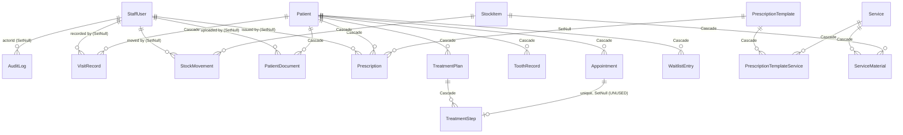

# Data model and application logic

How DentOrganizer's tables come into existence, how they reference each other,
and which parts of the app are *derived* rather than stored. Companion document:
[IMPROVEMENTS.md](IMPROVEMENTS.md), which lists what is worth changing and why.

> Describes the tree at commit `5bb252c` plus the current uncommitted working
> copy.

---

## 1. How the tables are created

There is no SQL file anywhere in the repo. Every table is generated from one
declarative source.

```
prisma/schema.prisma          ← the single source of truth (16 models, 5 enums)
        │
        ├── prisma db push ──→ PostgreSQL     (creates/alters tables directly)
        │   prisma migrate dev                (same, but writes a migration file)
        │
        └── prisma generate ─→ src/generated/prisma/   (the typed client)
```

### The pieces

| File | Role |
| --- | --- |
| [`prisma/schema.prisma`](../prisma/schema.prisma) | Model definitions. Declares `provider = "postgresql"` but **no** `url` — Prisma 7 moved that out of the schema. |
| [`prisma.config.ts`](../prisma.config.ts) | Supplies `DATABASE_URL` to the CLI (`process.loadEnvFile()`, since Prisma 7 no longer auto-loads `.env`) and registers the seed command. |
| [`src/generated/prisma/`](../src/generated/prisma/) | The generated client — **committed to the repo**, one file per model. Regenerated by `postinstall` and by `npm run build`. |
| [`src/lib/prisma.ts`](../src/lib/prisma.ts) | The one client instance. Uses the `@prisma/adapter-pg` driver adapter over `pg`, and caches the instance on `globalThis` in dev so hot reload doesn't exhaust the connection pool. |
| [`prisma/seed.ts`](../prisma/seed.ts) | Demo data. Wipes first, in FK-safe order, then rebuilds. |

### The commands

```bash
npm run db:push      # sync schema → database, no migration file (current workflow)
npm run db:migrate   # create + apply a named migration
npm run db:seed      # demo data — DELETES every row first
npm run db:studio    # browse the database
```

There is **no `prisma/migrations/` directory** — the project has only ever used
`db push`. See [IMPROVEMENTS.md §4.1](IMPROVEMENTS.md#41-no-migration-history).

### Conventions applied to every table

- **Primary keys** are `String @id @default(uuid())`. No integers, no
  auto-increment — an id is safe to put in a URL and reveals no row count.
- **Timestamps** are `createdAt DateTime @default(now())`, and `updatedAt
  DateTime @updatedAt` where the app needs it (only 5 of 16 models have one).
- **Optional columns** are nullable rather than empty-string — the form helpers
  in [`src/lib/utils.ts`](../src/lib/utils.ts) (`optionalString`) turn `""` into
  `null` on the way in.
- **Calendar days** (`Appointment.date`, `VisitRecord.visitDate`,
  `Patient.dateOfBirth`) are stored at **UTC midnight** and rendered with
  `timeZone: 'UTC'`, so a day never shifts between server and browser. All the
  arithmetic lives in [`src/lib/dates.ts`](../src/lib/dates.ts).

---

## 2. The entity map



Read it as four clusters that barely touch:

1. **People and access** — `StaffUser`, `AuditLog`.
2. **The patient record** — `Patient` and everything that hangs off it.
3. **The catalog and the cupboard** — `Service` ⇄ `ServiceMaterial` ⇄
   `StockItem` ⇄ `StockMovement`.
4. **The diary** — `Appointment`, `WaitlistEntry`.

Clusters 2/4 and 3 are joined **by key**, and each key carries a name snapshot
beside it:

| Reference | Key | Snapshot |
| --- | --- | --- |
| An appointment's treatment | `Appointment.serviceId` | `serviceName` |
| A waiting person's treatment | `WaitlistEntry.serviceId` | `serviceName` |
| What a visit actually did | `VisitService.serviceId` (one row each) | `VisitService.name` |

All three were plain strings, and `VisitRecord.services` was the worst of them:
a comma-separated list in one column, so a treatment whose name contained a
comma silently became two, and the statistics page grouped by typed text rather
than by catalogue entry. `VisitRecord.servicesText` survives as *display only* —
the sentence somebody wrote, which the follow-up message quotes back — while the
rows are the record. Same split as `Prescription.body` against its template:
renaming a service must never rewrite what a visit says was done.

Existing rows were converted by
[`prisma/backfill-services.ts`](../prisma/backfill-services.ts), which matches
names case- and accent-folded and leaves anything unmatched as free text with a
null `serviceId` — the honest answer for a service since renamed or deleted.

---

## 3. Table reference

### 3.1 People and access

#### `StaffUser`
Everyone who signs in. No self-service signup — the owner creates each row from
the Staff page.

| Column | Type | Notes |
| --- | --- | --- |
| `id` | uuid PK | |
| `firstName`, `lastName` | String | |
| `role` | `Role` enum | `OWNER` · `ASSISTANT` · `RECEPTIONIST` · `READONLY`, default `RECEPTIONIST` |
| `pinHash`, `pinSalt` | String | scrypt digest, hex. Never the PIN. |
| `active` | Boolean | Deactivation replaces deletion so the audit trail stays readable |
| `failedAttempts`, `lockedUntil` | Int, DateTime? | Brute-force guard: 5 strikes → 5-minute lockout |
| `lastLoginAt` | DateTime? | |

Indexes: `@@index([active])`.
Children (all `SetNull`): `AuditLog`, `VisitRecord`, `StockMovement`,
`PatientDocument`, `Prescription`.

`SetNull` everywhere is the deliberate counterpart to "staff are never deleted":
if a row ever *is* removed, the clinical records it produced survive with the
name intact, because names are snapshotted where they matter.

#### `AuditLog`
Append-only. Written by the guard, never updated, readable only by the owner.

| Column | Notes |
| --- | --- |
| `actorId` | FK → `StaffUser`, nullable, `SetNull` |
| `actorName` | **Snapshot.** Survives rename, demotion, deletion |
| `actorRole` | `Role?` — null when the actor is a patient answering a confirmation link |
| `action` | free String: `create` · `update` · `delete` · `login` · `logout` · `denied` · `confirmed` · `declined` |
| `entity` | free String: `patient` · `appointment` · `visit` · `tooth` · `stock` · `service` · `staff` · `session` · `recall` · `waitlist` · `plan` · `document` · `prescription` · `backup` |
| `entityId` | String? — no FK, on purpose: the row it points at may be gone |
| `summary` | Pre-composed for display, so rendering the feed needs no joins |

Indexes: `createdAt`, `entity`, `actorId`.

### 3.2 The patient record

#### `Patient`
The hub. Seven child tables cascade from it.

| Column | Notes |
| --- | --- |
| `firstName`, `lastName`, `phone` | Required. **No uniqueness on `phone`** — duplicates are possible |
| `email`, `dateOfBirth`, `medicalNotes` | Optional |
| `recallMonths` | Int, default 6. `0` opts the patient out of recall entirely |
| `recallSnoozedUntil` | Set by "remind me later" |
| `lastRecallAt` | Stamped when the recall message is opened |

No indexes beyond the PK — including none on `lastName`, which every list
orders by.

#### `Appointment`

| Column | Notes |
| --- | --- |
| `patientId` | FK → `Patient`, **Cascade** |
| `date` | DateTime at **UTC midnight** — the calendar day |
| `startTime` | **String `"HH:MM"`** — not a time column |
| `durationMin` | Int, default 30 |
| `status` | `SCHEDULED` · `COMPLETED` · `CANCELLED` · `NO_SHOW` |
| `serviceName` | String? — a **label**, no FK to `Service` |
| `confirmedAt`, `declinedAt` | Set by the patient's own confirmation link |
| `planStep` | Back-relation from `TreatmentStep` — **never written or read by the app** |

Indexes: `date`, `patientId`.

`date` + `startTime` as (day, string) is why overlap detection happens in
JavaScript rather than SQL — see [§5.1](#51-scheduling).

#### `VisitRecord`
What actually happened, written after the fact.

| Column | Notes |
| --- | --- |
| `patientId` | Cascade |
| `visitDate` | UTC midnight |
| `notes` | Required |
| `servicesText` | String, DB column still `services`. **Display only** — the line as typed |
| `services` | `VisitService[]` — one row per treatment. This is the record |
| `staffUserId` | SetNull |

Indexes: `patientId`, `visitDate`.

#### `ToothRecord`
One row per *non-default* tooth.

| Column | Notes |
| --- | --- |
| `patientId`, `toothNum` | `@@unique([patientId, toothNum])` — the upsert key |
| `status` | **String**, not an enum. The 8 valid values live in TypeScript only ([`teeth.ts`](../src/lib/teeth.ts)) |
| `notes` | |

The chart is sparse by design: "healthy with no note" deletes the row instead of
storing it ([`patients.ts:203-206`](../src/lib/actions/patients.ts)), so a chart
summary counts only real findings.

Numbering is the Universal Numbering System, 1–32: 1–16 upper, 17–32 lower.

#### `TreatmentPlan` / `TreatmentStep`
A course of treatment that outlives one visit.

- `TreatmentPlan` → `Patient` (Cascade), status `ACTIVE` · `COMPLETED` ·
  `CANCELLED`.
- `TreatmentStep` → `TreatmentPlan` (Cascade), ordered by a 1-based `position`
  (gaps allowed; only the order matters), status `PENDING` · `DONE` · `SKIPPED`.
- `TreatmentStep.appointmentId` is `@unique`, FK → `Appointment`, `SetNull` —
  the intended "booking a step links it to the calendar" edge. **It is dead:**
  no code path writes or reads it.

#### `PatientDocument`
The index for X-rays, photos and consent forms. The bytes are on disk.

| Column | Notes |
| --- | --- |
| `patientId` | Cascade |
| `kind` | `XRAY` · `PHOTO` · `CONSENT` · `ID_FRONT` · `ID_BACK` · `OTHER`. The two ID faces are held apart from `OTHER` so the patient's details tab can draw them as a card with two sides, and so the file gallery can leave them out of its grid |
| `fileName`, `mimeType`, `sizeBytes` | `fileName` is the user's original name — display only |
| `storageKey` | `@unique`. A generated uuid + extension. **Never** derived from the upload |
| `toothNum` | Int?, optional link to a tooth |
| `uploadedById` | SetNull |

Files live under `FILE_STORAGE_DIR` (default `./storage/patient-files`),
deliberately outside `public/`, and are served only by
[`/api/documents/[id]`](../src/app/api/documents/[id]/route.ts) after a
`document.view` check.

#### `PrescriptionTemplate` / `PrescriptionTemplateService` / `Prescription`

- `PrescriptionTemplate` — reusable wording. No unique constraint on `name`.
- `PrescriptionTemplateService` — which treatments a piece of wording follows.
  Composite key `(templateId, serviceId)`, Cascade from both sides.
- `Prescription` — `patientId` (Cascade), `templateId` (**SetNull**),
  `issuedById` (SetNull), and its **own `body`**.

The `body` duplication is the point: editing or deleting a template must never
rewrite what a patient was actually handed.

`PrescriptionTemplateService` is the edge that makes the template list usable.
Without it the dialog offered every template the practice had ever saved in one
flat list, so after a surgical extraction the dentist read past whitening
aftercare to find the antibiotic. With it, the wording tied to the treatment
recorded in the last fortnight is offered first and the rest sits underneath.

### 3.3 Catalog and cupboard

#### `Service`
`name`, `category?`, `durationMin` (default 30). No price column — billing is
out of scope by design. No uniqueness on `name`.

#### `StockItem`
`name`, `category?`, `quantity`, `minLimit` (default 5), `unit` (default `pcs`),
`packSize` (default 1), `orderQty?`. No indexes.

`quantity` is counted in whole `unit`s — for bulk stock that unit is the box, and
a part-used box is not represented at all. `packSize` is the pieces inside one
unit and is used **only** to print the order form in the count the supplier sells
by; nothing else in the app converts between the two. `orderQty` is the owner's
stated "buy this many when low", which replaces the projection in `reorder.ts`
and, when set, also silences the line until the minimum is actually reached.

#### `ServiceMaterial` — the bill of materials
The only true join table in the schema.

```
Service 1──∞ ServiceMaterial ∞──1 StockItem
              @@unique([serviceId, itemId])
              quantity Int @default(1)
```

Both sides Cascade. Saving a service **replaces** its material rows wholesale
inside one transaction ([`services.ts:51-65`](../src/lib/actions/services.ts)) —
the form always submits the complete list.

#### `StockMovement` — the ledger
Append-only quantity changes. This table, not `StockItem.quantity`, is what the
analytics and reorder features actually read.

| Column | Notes |
| --- | --- |
| `itemId` | FK → `StockItem`, **Cascade** |
| `delta` | Int. Negative = consumed, positive = restocked |
| `reason` | **free String**: `manual` · `used` · `restock` · `used in visit` · `delivery` · `delivery reversed` · `stocktake` |
| `staffUserId` | SetNull |

Indexes: `itemId`, `createdAt`.

There is no link back to the visit that caused a movement — `reason` is the only
trace, and it is prose.

### 3.4 The waiting list

#### `WaitlistEntry`
Who wants an earlier slot.

`patientId` (Cascade), `serviceName?` (text again), `durationMin`, `note?`,
`urgent`, `createdAt`, `resolvedAt?`.

Indexed on `resolvedAt` only — the open-list query (`resolvedAt: null`, ordered
urgent-first then oldest) is the only one that runs. Nothing resolves an entry
automatically; booking the person is a separate manual action.

---

## 4. Referential behaviour at a glance

| Parent → child | Rule | Consequence |
| --- | --- | --- |
| `Patient` → Appointment, VisitRecord, ToothRecord, TreatmentPlan, PatientDocument, Prescription, WaitlistEntry | **Cascade** | Deleting a patient erases their entire clinical history in one statement. Owner-only, and the UI warns — but it is a hard delete with no undo, and it **leaves uploaded files orphaned on disk** ([IMPROVEMENTS §1.1](IMPROVEMENTS.md#11-deleting-a-patient-orphans-their-files-on-disk)) |
| `TreatmentPlan` → `TreatmentStep` | Cascade | Correct — a step has no meaning without its plan |
| `Service` → `ServiceMaterial` | Cascade | Correct — the BOM belongs to the service |
| `StockItem` → `ServiceMaterial` | Cascade | Correct |
| `StockItem` → `StockMovement` | **Cascade** | Deleting a material silently erases its entire consumption history from the analytics chart |
| `StaffUser` → AuditLog, VisitRecord, StockMovement, PatientDocument, Prescription | SetNull | Correct, and paired with "deactivate, never delete" |
| `PrescriptionTemplate` → `Prescription` | SetNull | Correct — the issued text is kept separately |
| `Appointment` → `TreatmentStep` | SetNull | Correct in principle; the relation is unused |

---

## 5. Derived logic — what is computed rather than stored

The app stores remarkably little state and recomputes most of what it shows.
That is a strength: nothing goes stale, and there are no maintenance jobs. It
also means the read paths are where the real complexity lives.

### 5.1 Scheduling
[`src/lib/scheduling.ts`](../src/lib/scheduling.ts)

- **`findConflicts()`** — loads every `SCHEDULED`/`COMPLETED` appointment on the
  day, converts `"HH:MM"` to minutes, and does interval-overlap in memory.
  `CANCELLED` and `NO_SHOW` deliberately do not block: the chair is free.
- **`findFreeGaps()`** — merges the day's bookings into non-overlapping runs,
  then returns the holes between `DAY_START_HOUR` (8) and `DAY_END_HOUR` (20).
  Whole gaps, not fixed slots, because the question is "will a 45-minute
  treatment fit?"
- **`nextSlotTime()`** — now, rounded up to the next 15 minutes, passed as
  `after` so "today's free time" means time still ahead.

Double-booking is a **warning, not a wall**: `saveAppointment` returns
`code: 'overlap'`, the dialog offers "book anyway", and the resubmit carries
`force=1` ([`appointments.ts:82-96`](../src/lib/actions/appointments.ts)).

### 5.2 Recalls and follow-ups
[`src/lib/recalls.ts`](../src/lib/recalls.ts)

`loadCandidates()` pulls every patient with `recallMonths > 0`, each with their
single most recent `VisitRecord` and a probe for any future `SCHEDULED`
appointment. Two lists come out of the same data:

- **Recall** — due when `lastVisit + recallMonths <= today`. Suppressed if the
  patient is already booked, snoozed, or contacted within 30 days. A patient who
  has never been seen counts from `createdAt`, so they cannot sit invisible.
- **Follow-up** — 2 to 7 days after a visit, and not later.

Nothing is ever sent. Each row builds a `wa.me` or `mailto:` draft
([`reminders.ts`](../src/lib/reminders.ts)); the dentist stays the sender.

### 5.3 Patient reliability
[`src/lib/reliability.ts`](../src/lib/reliability.ts)

A `groupBy(status)` over the patient's **past** appointments →
`unknown` (fewer than 3) · `reliable` (0 no-shows) · `watch` · `at-risk`
(≥ 34 % missed). Cancellations count toward history but **not** against the
patient — calling ahead is the behaviour you want. `getReliabilityMap()` does
the whole list in one query, so list screens stay flat.

### 5.4 Stock consumption and reordering

**Write side** — [`stock-consumption.ts`](../src/lib/stock-consumption.ts):
recording a visit looks up `ServiceMaterial` for every catalog service picked,
**sums materials shared by two services into one line**, clamps at what is on
hand, then in one transaction decrements `StockItem.quantity` and writes one
`StockMovement` per material.

**Read side** — [`reorder.ts`](../src/lib/reorder.ts): sums 90 days of *negative*
movements only (restocking is not demand) to get a burn rate, projects
`daysLeft`, and suggests `ceil(dailyUse × 60) + minLimit − onHand`. Output is a
shopping list, never an order — nothing is written back.

`getLowStockItems()` ([`queries.ts`](../src/lib/queries.ts)) filters
`quantity <= minLimit` **in memory**, because Prisma cannot compare two columns
portably.

### 5.5 Confirmation links
[`src/lib/confirmations.ts`](../src/lib/confirmations.ts)

The token is `<appointmentId>~<hmac>` — an HMAC-SHA256 of
`"appointment-confirmation:v1:<id>"`, truncated to 128 bits, base64url. **No
token table exists.** There is nothing to leak, nothing to expire, nothing to
clean up. The separator is `~` rather than `.` because a dot makes the path
segment look like a static file to next-intl's middleware matcher.

Verification is constant-time. `respondToAppointment()` is the only server
action in the app that runs **without a session** — its entire authority is that
signature, and it touches exactly two columns on exactly one row. Declining sets
`status = CANCELLED`, which is what frees the slot for the waiting list.

### 5.6 Analytics
[`analytics/page.tsx`](../src/app/[locale]/(app)/analytics/page.tsx)

Six months of raw rows are pulled in parallel and bucketed by month in memory.
Top services is a **`groupBy` over `VisitService.serviceId`**, labelled with the
catalog's *current* name, so a service renamed last month shows its whole
history under one bar. Anything typed by hand has no id and is counted by name,
shown as itself rather than dropped. The appointment-status donut is windowed to
the same six months as everything else on the page.

---

## 6. How a write happens

Every mutation is a Next.js server action in
[`src/lib/actions/`](../src/lib/actions/), one file per entity, and every one
follows the same six steps:

```ts
export async function saveThing(_prev: ActionState, formData: FormData) {
  const t = await getTranslations('errors');

  const user = await authorize('thing.edit');        // 1. permission, or null
  if (!user) return actionError(t('forbidden'));

  const name = requiredString(formData.get('name')); // 2. parse + coerce
  if (!name) return actionError(t('fillRequired'));

  try { await prisma.thing.create(...) }             // 3. write
  catch { return actionError(t('generic')) }

  await recordAudit(user, { ... });                  // 4. trail
  revalidatePath('/', 'layout');                     // 5. invalidate
  return actionOk();                                 // 6. { status, ts }
}
```

Notes on each step:

1. **`authorize()`** ([`guard.ts`](../src/lib/auth/guard.ts)) is the real
   boundary. Pages also call `requirePermission()`, but that only stops a
   hand-typed URL; the action check is what stops a forged POST for a button
   that was never rendered. A refusal is itself written to the audit log.
2. Coercion is manual and defensive — `toInt`, clamps (`Math.max(5, …)`), regex
   checks on dates and times, and `value in Enum` guards that fall back to the
   default rather than throwing. There is **no schema validation library**.
3. Multi-row writes use `prisma.$transaction` — booking a first-time patient,
   replacing a bill of materials, swapping two step positions, deducting stock.
4. `recordAudit` is wrapped in try/catch and **never** propagates: a clinic
   losing a patient record because the log was busy would be the worse failure.
5. `revalidatePath('/', 'layout')` — deliberately coarse. Every page is
   `force-dynamic` anyway, so this is closer to a cache flush than a targeted
   invalidation.
6. `ActionState` carries a `ts` so a client dialog can tell one successful
   submit from the next, and an optional `code` (`'overlap'`) for the one error
   the UI can offer to work around.

### Permission model

The whole thing is one table in
[`permissions.ts`](../src/lib/auth/permissions.ts): 29 `resource.action`
permissions × 4 roles. Nothing else decides who may do what — the Staff page
renders the same table so the owner can read the answer without reading code.

Two rules are structural rather than incidental:

- **Deletion is owner-only across the board.** Everyone else cancels,
  deactivates or corrects.
- **Clinical data is stripped server-side, not hidden with CSS.** The patient
  detail page computes `medicalNotes = canSeeMedical ? … : ''` *once*, before
  handing anything to a client component, because a hidden field still ships to
  the browser. The tab list is filtered the same way, so `?tab=chart` typed by
  hand lands on Details.

### Session

Cookie = `base64url(payload).base64url(hmac)`, built on **Web Crypto** so the
same code verifies in the edge proxy and in a server action. The payload carries
**only the user id** — the role is re-read from the database on every request
([`session.ts`](../src/lib/auth/session.ts)), so demoting someone takes effect
on their next click, and a deactivated account stops working mid-shift.
`cache()` keeps that to one query per request.

---

## 7. Invariants worth not breaking

| Invariant | Enforced by |
| --- | --- |
| A calendar day is one exact value | Everything normalises to UTC midnight; formatting pins `timeZone: 'UTC'` |
| A healthy tooth with no note stores no row | `saveToothRecord` deletes instead of upserting |
| Every quantity change has a matching `StockMovement` | Every write path (`saveStockItem`, `adjustStock`, `consumeMaterialsForServices`, `saveBatch`, `deleteBatch`, `saveStocktake`) pairs the update and the movement in one transaction |
| A stocktake only asserts what was counted | `StocktakeForm` submits edited rows only, and `saveStocktake` derives each delta inside the transaction from the row's real quantity — never the figure the browser was shown |
| An issued prescription's text never changes | `Prescription.body` is its own column; `templateId` is `SetNull` |
| The audit trail keeps reading after a person leaves | `actorName`/`actorRole` snapshots + `SetNull` + "deactivate, never delete" |
| There is always one active owner | `isLastActiveOwner()` blocks the last demotion and the last deactivation |
| An uploaded file is never named by the user | `storeFile()` generates the key; `resolveKey()` rejects anything that is not a bare filename |
| A patient file is never served without a session | Files live outside `public/`; `/api/documents/[id]` 404s (not 403s) without `document.view` |
| Backups never contain PIN hashes | The export selects columns explicitly |
